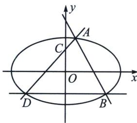
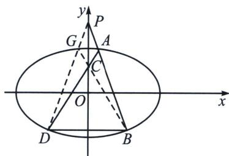

<!-- question-source:start -->
例6 (2024·北京)已知椭圆方程 $E: \frac{x^2}{a^2} + \frac{y^2}{b^2} = 1 (a > b > 0)$ , 以椭圆 $E$ 的焦点和短轴端点为顶点的四边形是边长为 2 的正方形. 过点 $(0, t)(t > \sqrt{2})$ 且斜率存在的直线与椭圆 $E$ 交于不同的两点 $A, B$ , 过点 $A$ 和 $C(0, 1)$ 的直线 $AC$ 与椭圆 $E$ 的另一个交点为 $D$ .

(1)求椭圆 E 的方程及离心率;

(2)若直线 $BD$ 的斜率为 0，求 $t$ 的值.

(1)椭圆方程为 $\frac{x^2}{4} +\frac{y^2}{2} = 1$ ，离心率为 $e = \frac{\sqrt{2}}{2}$

(2)【射影背景 & 极点极线】将 $D$ 与点 $P(0, t)$ 连接交椭圆于点 $G$ ，再连接 $AG$ 、 $BG$ ，由 $BD$ 的斜率为 0 及椭圆的对称性知： $AD \cap BG = C$ ，点 $P(0, t)$ 的极线为过 $C$ 点的水平线 $y = 1$ ，故 $\frac{2}{t} = 1$ ，故 $t = 2$
<!-- question-source:end -->

![[高中/总复习/专题/2026版高中《mst老唐说题》圆锥曲线专题（数学）/下册/第12章_调和点列与调和线束定理与对合关系/第二节_调和线束两大定理的应用/一_调和线束平行中点定理/例题/answers/Q00048812A1.md]]
