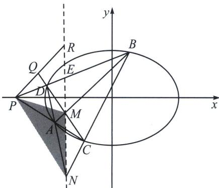

<!-- question-source:start -->
例8（2018·北京文）已知椭圆 $M: \frac{x^2}{a^2} + \frac{y^2}{b^2} = 1 (a > b > 0)$ 的离心率为 $\frac{\sqrt{6}}{3}$ ，焦距为 $2\sqrt{2}$ 。斜率为 $k$ 的直线 $l$ 与椭圆 $M$ 有两个不同的交点 $A$ 、 $B$ .

(1)求椭圆 M 的方程;

(2) 若 $k=1$ ，求 $|AB|$ 的最大值；

(3)设 $P(-2,0)$ ，直线 PA 与椭圆 M 的另一个交点为 C，直线 PB 与椭圆 M 的另一个交点为 D。若 C，D 和点 $Q\left(-\frac{7}{4},\frac{1}{4}\right)$ 共线，求 k。

(2)设直线 $AB$ 的方程为 $y = x + m$ ， $A(x_{1},y_{1})$ ， $B(x_{2},y_{2})$ ，由 $\left\{ \begin{array}{l}y = x + m\\ \frac{x^2}{3} +y^2 = 1 \end{array} \right.$

消去 $y$ 可得： $4x^{2} + 6mx + 3m^{2} - 3 = 0$ ，则 $\Delta = 36m^{2} - 4 \times 4(3m^{2} - 3) > 0$ ，即 $m^{2} < 4$ ， $x_{1} + x_{2} = -\frac{3m}{2}$ ， $x_{1}x_{2} = \frac{3m^{2} - 3}{4}$ ，则 $|AB| = \sqrt{1 + k^{2}} |x_{1} - x_{2}| = \frac{\sqrt{6} \times \sqrt{4 - m^{2}}}{2}$ ，

易得当 $m^2 = 0$ 时， $|AB|_{\max} = \sqrt{6}$ ，故 $|AB|$ 的最大值为 $\sqrt{6}$ .

(3)极点极线背景
<!-- question-source:end -->

![[高中/总复习/专题/2026版高中《mst老唐说题》圆锥曲线专题（数学）/下册/第12章_调和点列与调和线束定理与对合关系/第二节_调和线束两大定理的应用/一_调和线束平行中点定理/例题/answers/Q00048814A1.md]]
