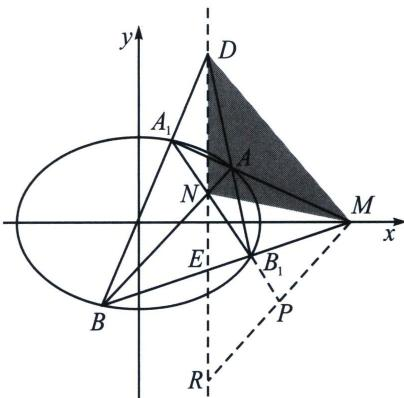

<!-- question-source:start -->
例9 已知椭圆 $C: \frac{x^2}{4} + \frac{y^2}{3} = 1$ ，斜率为 1 的直线 $l$ 与椭圆交于 $A$ 、 $B$ 两点，点 $M(4,0)$ ，直线 $AM$ 与椭圆交于点 $A_1$ ，直线 $BM$ 与椭圆交于 $B_1$ ，求证：直线 $A_1 B_1$ 过定点.

<!-- question-source:end -->

![[高中/总复习/专题/2026版高中《mst老唐说题》圆锥曲线专题（数学）/下册/第12章_调和点列与调和线束定理与对合关系/第二节_调和线束两大定理的应用/一_调和线束平行中点定理/例题/answers/Q00048815A1.md]]
