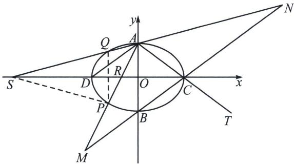

<!-- question-source:start -->
例10（2025·北京清华附中高三开学）已知椭圆 $E: \frac{x^2}{a^2} + \frac{y^2}{b^2} = 1 (a > b > 0)$ ，其离心率 $e = \frac{\sqrt{5}}{3}$ ，长轴长为6.

(1)求椭圆 E 的标准方程;

(2)椭圆 E 的上、下顶点分别为 A、B，右顶点为 C，过点 A 的直线 l 与椭圆 E 的另一个交点为 P，点 Q 与点 P 关于 x 轴对称，直线 AP 交 BC 于 M，直线 AQ 交 BC 于点 N，点 T(6, -2)，

求证： $|AM|=|TN|$ .

## 解析
(1) $\frac{x^2}{9} + \frac{y^2}{4} = 1$ ;

(2)极点极线背景分析: $P 、 Q$ 关于 $x$ 轴对称, 符合角平分线构造调和点列模型, 设 $A P 、 A Q$ 分别交 $x$ 轴于点 $R 、 S , D$ 为椭圆左顶点, 则 $(C, D; R, S) = -1$ ,

利用交比不变性 $A(C, D; R, S) = A(C, \infty; M, N) = -1$ ，所以 $|CM| = |CN|$ ，又 $|AC| = |CT|$ ，所以通过平行四边形 $AMTN$ 得： $|AM| = |TN|$ .
<!-- question-source:end -->
