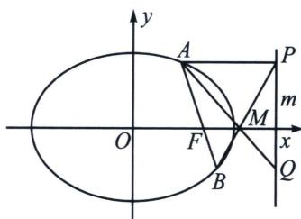

<!-- question-source:start -->
例3 (2023·宁德模拟)已知椭圆 $C: \frac{x^2}{a^2} + \frac{y^2}{b^2} = 1 (a > b > 0)$ 的离心率为 $\frac{\sqrt{2}}{2}$ , 过点 $(-1, \frac{\sqrt{2}}{2})$ .

(1)求椭圆 C 的标准方程;

(2)设椭圆的右焦点为 F，定直线 m: x=2，过点 F 且斜率不为零的直线 l 与椭圆交于 A，B 两点，过 A，B 两点分别作 $AP \perp m$ 于 P， $BQ \perp m$ 于 Q，直线 AQ、BP 交于点 M，证明：M 点为定点，并求出 M 点的坐标.

<!-- question-source:end -->

![[高中/总复习/专题/2026版高中《mst老唐说题》圆锥曲线专题（数学）/下册/第12章_调和点列与调和线束定理与对合关系/第二节_调和线束两大定理的应用/一_调和线束平行中点定理/例题/answers/Q00053166A1.md]]
