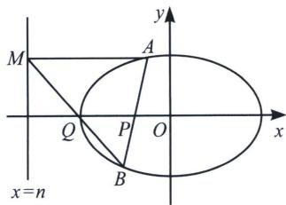
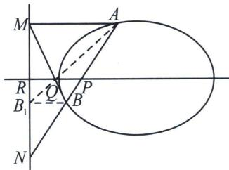

> [!faq]- 《圆锥曲线专题(下册)》例题解析
>
> > [!success]- **【答案】** 详见解析
>
> > [!note]- **【分析】**
> > 本题未单列分析。
>
> > [!note]- **【解析】**
> > 解析
> > 解法二(梯形中点证明): 如图, 过 $E$ 作 $MN \parallel x$ 轴, 由于 $MN \parallel AC \parallel BD$ , 所以 $\frac{ME}{AC} = \frac{DE}{DA}$ , $\frac{NE}{AC} = \frac{BE}{BC}$ , 又因为梯形 $ABCD$ , 故 $\frac{DE}{DA} = \frac{BE}{BC}$ , 所以 $\frac{ME}{AC} = \frac{NE}{AC}$ , 所以 $x_E = \frac{x_M + x_N}{2} = \frac{m + x_N}{2}$ , $y_E = y_N$ , 由于 $y_N = x_N + b = x_N + m - 1$ , 故 $y_E = 2x_E - m + m - 1 = 2x_E - 1$ , 所以点 $E$ 在定直线 $2x - y - 1 = 0$ 上运动.
> > 注意 这个题充分体现了解析几何在于多想少算的思想，对于极点极线和对合的背景解读，成为拿下解析几何高端局的必备。
> > ## 2. 射影到与坐标轴平行线的中点
> > 如图所示, 在椭圆 $\frac{x^{2}}{a^{2}} +\frac{y^{2}}{b^{2}} = 1(a > b > 0)$ 中, $A$ 、 $B$ 为椭圆上的两点, 设 $x$ 轴上一点 $P(m,0)$ , 存在直线 $x = n$ 和 $x$ 轴上一点 $Q$ , 连接 $BQ$ 并延长交直线 $x = n$ 于 $M$ , $n = \frac{a^2}{m}$ , 当直线 $AM // x$ 轴, 则: $x_{Q} = \frac{m + \frac{a^{2}}{m}}{2}$ .
> > 
> > 
> > 极点极线背景分析：延长 $AB$ 交 $x = n$ 于 $N$ ，作 $BB_{1} \parallel AM$ 交 $MN$ 于 $B_{1}$ ，由以 $P$ 为极点对应的极线为 $MN$ ，则 $A, P, B, N$ 为调和点列，梯形 $AMB_{1}B$ 为调和梯形，则 $Q$ 为 $PR$ 中点.
> > ## 高中数学 新思路 圆锥专题
> > 或者利用交比不变性，以 M 作为射影中心， $M(A, B; P, N) = M(\infty, Q; P, R) = -1$ ，所以 PQ = QR.
