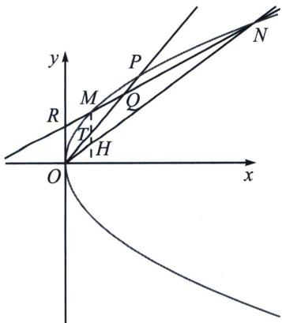
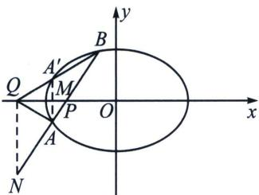
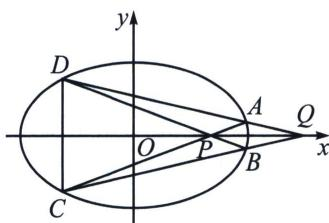
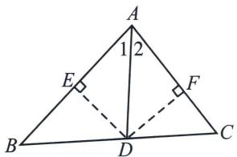
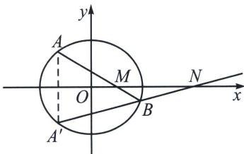

> [!faq]- 《圆锥曲线专题(下册)》例题解析
>
> > [!success]- **【答案】** 详见解析
>
> > [!note]- **【分析】**
> > 令 $R(0, 2)$ , $OP$ 交 $MN$ 于点 $Q\left(\frac{2}{1-k}, \frac{2}{1-k}\right)$ , 且满足 $y_{R}y_{Q}=2(x_{R}+x_{Q})$ , 由于 $\overrightarrow{MT}=\overrightarrow{TH}$ , 根据交比不变性, 则 $O(M, H; T, \infty)=O(M, N; Q, R)=-1$ , $H、N、O$ 三点共线, 故 $HN$ 过原点.
>
> > [!note]- **【解析】**
> > 解答书写过程：
> > 
> > 证明：设 $M(x_{1},y_{1})$ ， $N(x_{2},y_{2})$ ，由于 $y - y_{1} = \frac{y_{1} - y_{2}}{\frac{y_{1}^{2}}{4} - \frac{y_{2}^{2}}{4}}\left(x - \frac{y_{1}^{2}}{4}\right)$ ，整理得 $MN:(y_1 + y_2)y = 4x + y_1y_2$ ，由于过点 $R(0,2)$ ，故 $2(y_{1} + y_{2}) = y_{1}y_{2}$ ， $k_{OM} =$ $\frac{y_1}{x_1} = \frac{4}{y_1}$ ， $k_{OM} = \frac{y_1}{x_1} = \frac{4}{y_1}$ ， $k_{ON} = \frac{y_2}{x_2} = \frac{4}{y_2}$ ，此时 $k_{OM} + k_{ON} = \frac{4}{y_1} +\frac{4}{y_2} = \frac{4(y_1 + y_2)}{y_1y_2} = 2$ $= 2k_{OP}$ ，由于 $\overrightarrow{MT} = \overrightarrow{TH}$ ，故 $k_{OM} + k_{OH} = 2k_{OT} = 2$ ， $H$ 、 $N$ 、 $O$ 三点共线，
> > 所以直线 HN 过定点 $(0, 0)$ .
> > ## 3. 调和等腰梯形对称构造
> > 已知 $AB$ 交椭圆 $\frac{x^2}{a^2} + \frac{y^2}{b^2} = 1 (a > b > 0)$ 长轴(短轴)于点 $P, B, B^r$ 是椭圆上关于长轴(短轴)对称的两点, 直线 $AB'$ 交长轴(短轴)于 $Q$ , 即满足 $\angle AQP = \angle BQP$ , 则 $\frac{x_P x_Q}{a^2} = 1$ 或 $\frac{y_P y_Q}{b^2} = 1$ . (双曲线也有相同调和共轭性质)
> > 
> > 
> > 我们同样也可以根据调和梯形来解释角平分线定理，如下图所示，已知椭圆方程为 $C: \frac{x^2}{a^2} + \frac{y^2}{b^2} = 1 (a > b > 0)$ ，若以 $P$ 为对角线交点的梯形的一组对边垂直于 $x$ 轴，则 $P$ 必在 $x$ 轴上，且点 $P$ 所对极线也必垂直于 $x$ 轴，此时有极线方程为 $x_Q = \frac{a^2}{x_P}$ ，根据调和梯形性质，此时是等腰梯形，一定有 $\angle AQP = \angle BQP$ .
> > 极点极线背景
> > 分析：
> > 方案一: 如左图, 由于 $P Q (x$ 轴) 为 $\angle A Q B$ 的内角平分线, 则 $Q N (y$ 轴) 为 $\angle A Q B$ 的外角平分线, 此时
> > $(N, P; A, B) = -1$ ，所以 $\frac{x_P x_Q}{a^2} = 1$
> > (1)补充三角形的内角平分线定理：在 $\triangle ABC$ 中，若 $AD$ 是 $\angle A$ 的平分线，则有 $\frac{AB}{AC}=\frac{BD}{DC}$ .
> > 证明：如左图所示，作 $DE \perp AB$ 交 $AB$ 于 $E$ ， $DF \perp AC$ 交 $AC$ 于 $F$ ，设 $BC$ 边上的高为 $h$ ，易知 $DE = DF$ ， $\frac{S_{\triangle ABD}}{S_{\triangle ACD}} = \frac{AB \cdot DE}{AC \cdot DF} = \frac{BD \cdot h}{DC \cdot h} \Rightarrow \frac{AB}{AC} = \frac{BD}{DC}$ .
> > 
> > 
> > (2)补充外角平分线定理：在 $\triangle ABC$ 中，若 $AE$ 是 $\angle BAC$ 的外角平分线，则有 $\frac{AB}{AC}=\frac{BE}{EC}$ .
> > 证明如右图，作 $EF \perp AC$ 延长线交于 $F$ ， $EG \perp AB$ 延长线于 $G$ ，设 $BC$ 边上的高为 $h$ ，易知 $EF = EG$ ， $\frac{S_{\triangle ABE}}{S_{\triangle ACE}} = \frac{AB \cdot EG}{AC \cdot EF} = \frac{BE \cdot h}{CE \cdot h} \Rightarrow \frac{AB}{AC} = \frac{BE}{EC}$ .
> > 我们还能发现 $\angle DAE=90^{\circ}$ ，所以A在以DE为直径的圆上，这就是著名的阿氏圆。
> > 方案二：由于 $QN \parallel AA'$ ，且 $MA = MA'$ ，故 $Q(N, P; A, B) = Q(\infty, M; A, A')$ ，所以 $(N, P; A, B) = -1$ ，因为 $x_Q = x_N$ ，所以 $P$ 与 $Q$ 调和共轭.
> > 代数解读：
> > 如图，过定点 $M(m, 0)$ 的直线与椭圆 $\frac{x^2}{a^2} + \frac{y^2}{b^2} = 1 (a > b > 0)$ 相交于 $A(x_1, y_1)$ 、 $B(x_2, y_2)$ 两点，作点 $A$ 关于 $x$ 轴的对称点 $A'(x_1, -y_1)$ ，则直线 $A'B$ 恒过定点 $N\left(\frac{a^2}{m}, 0\right)$ .
> > 
> > 证明：由 A、B、M 三点共线可得： $x_{1}y_{2}-x_{2}y_{1}=m(y_{2}-y_{1})$ ①，且 $x_{1}^{2}=a^{2}-\frac{a^{2}}{b^{2}}y_{1}^{2}$ ， $x_{2}^{2}=a^{2}-\frac{a^{2}}{b^{2}}y_{2}^{2}$ ②，
> > 又 $(x_{1}y_{2}-x_{2}y_{1})(x_{1}y_{2}+x_{2}y_{1})=x_{1}^{2}y_{2}^{2}-x_{2}^{2}y_{1}^{2}$ ③，①②代入③得： $x_{1}y_{2}+x_{2}y_{1}=\frac{a^{2}}{m}(y_{2}+y_{1})$ ，此时，结合直线 $A^{\prime}B$ 的两点式，即 $x_{1}y_{2}-x_{2}(-y_{1})=\frac{a^{2}}{m}[y_{2}-(-y_{1})]$ ，显然，直线 $A^{\prime}B$ 恒过定点 $N\left(\frac{a^{2}}{m},0\right)$ .
> > 第一类： $x$ 轴的轴点弦
> > 过定点 $M(m0)$ 的直线与椭圆 $\frac{x^2}{a^2} +\frac{y^2}{b^2} = 1(a > b > 0)$ 相交于 $A$ 、 $B$ 两点，设 $A(x_{1}y_{1})$ ， $B(x_{2}y_{2})$ ，则有： $\left\{ \begin{array}{l}x_{1}y_{2} - x_{2}y_{1} = m(y_{2} - y_{1})①\\ x_{1}y_{2} + x_{2}y_{1} = \frac{a^{2}}{m} (y_{2} + y_{1})② \end{array} \right.$ ；由 $① + ②$ 可得： $2x_{1}y_{2} = \left(m + \frac{a^{2}}{m}\right)y_{2} - \left(m - \frac{a^{2}}{m}\right)y_{1}$ ，解得 $y_{2} = \frac{\left(m - \frac{a^{2}}{m}\right)y_{1}}{\left(m + \frac{a^{2}}{m}\right) - 2x_{1}},$
> > 由②-①可得： $2x_{2}y_{1}=\left(m+\frac{a^{2}}{m}\right)y_{1}-\left(m-\frac{a^{2}}{m}\right)y_{2}$
> > 即 $y_{1} = \frac{\left(\frac{a^{2}}{m} - m\right)y_{2}}{2x_{2} - \left(\frac{a^{2}}{m} + m\right)} = \frac{\frac{a^{2}}{m} - m}{2x_{2} - \left(\frac{a^{2}}{m} + m\right)}\cdot \frac{\left(\frac{a^{2}}{m} - m\right)y_{1}}{2x_{1} - \left(\frac{a^{2}}{m} + m\right)}\Rightarrow x_{2} = -\frac{\left(m + \frac{a^{2}}{m}\right)x_{1} - 2a^{2}}{\left(m + \frac{a^{2}}{m}\right) - 2x_{1}}$ ，点 $B$ 的坐标都可以
> > 用点 $A$ 的坐标进行表示： $x_{2} = -\frac{\left(m + \frac{a^{2}}{m}\right)x_{1} - 2a^{2}}{\left(m + \frac{a^{2}}{m}\right) - 2x_{1}},y_{2} = \frac{\left(m - \frac{a^{2}}{m}\right)y_{1}}{\left(m + \frac{a^{2}}{m}\right) - 2x_{1}}.$
> > 第二类：y 轴的轴点弦
> > 过定点 $N(0, n)$ 的直线 $AB$ 和椭圆 $\frac{x^2}{a^2} + \frac{y^2}{b^2} = 1$ 相交，设 $A(x_1, y_1), B(x_2, y_2)$ ，则有：
> > $\left\{ \begin{array}{l} x_{1}y_{2} - x_{2}y_{1} = -n(x_{2} - x_{1})① \\ x_{1}y_{2} + x_{2}y_{1} = \frac{b^{2}}{n}(x_{1} + x_{2})② \end{array} \right.;$ 由 $② - ①$ 可得： $x_{2} = \frac{\left(n - \frac{b^{2}}{n}\right)x_{1}}{\left(n + \frac{b^{2}}{n}\right) - 2y_{1}}$ ，由 $① + ②$ 可得： $y_{2} = -\frac{\left(n + \frac{b^{2}}{n}\right)y_{1} - 2b^{2}}{\left(n + \frac{b^{2}}{n}\right) - 2y_{1}}$ ，所以： $x_{2} = \frac{\left(n - \frac{b^{2}}{n}\right)x_{1}}{\left(n + \frac{b^{2}}{n}\right) - 2y_{1}}, y_{2} = -\frac{\left(n + \frac{b^{2}}{n}\right)y_{1} - 2b^{2}}{\left(n + \frac{b^{2}}{n}\right) - 2y_{1}}$
> > 显然，所有的轴点弦，用一个点表示另一个点的方法，定比点差显然来得更加直接和简单，只是在处理坐标轴为角平分线题型时，将二次曲线转化为两个一次式相乘形式方便操作，这些操作用两点对合式也是超级简单，所以此类方法我们基本上不采用，数学方法不是越多越好，而是越高效越用.
