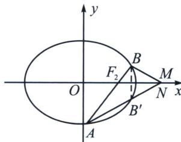

> [!faq]- 《圆锥曲线专题(下册)》例题解析
>
> > [!success]- **【答案】** A
>
> > [!note]- **【解析】**
> > 解析 (1)由已知得 $F(1,0)$ , $l$ 的方程为 $x = 1$ . 由已知可得点 $A$ 的坐标为 $\left(1, \frac{\sqrt{2}}{2}\right)$ 或 $\left(1, -\frac{\sqrt{2}}{2}\right)$ , 所以 $AM$ 的方程为 $y = -\frac{\sqrt{2}}{2} x + \sqrt{2}$ 或 $y = \frac{\sqrt{2}}{2} x - \sqrt{2}$ .
> >
> > (2)当 $l$ 与 $x$ 轴重合时, $\angle OMA = \angle OMB = 0^{\circ}$ . 当 $l$ 与 $x$ 轴垂直时, $OM$ 为 $AB$ 的垂直平分线, 所以 $\angle OMA = \angle OOM$ . 当 $l$ 与 $x$ 轴不重合也不垂直时, 设 $A(x_{1}, y_{1})$ , $B(x_{2}, y_{2})$ , 点 $B$ 关于 $x$ 轴对称的点 $B'(x_{2}, -y_{2})$ , 根据几何性质可得: 若 $x$ 轴上存在点 $N$ , 使得 $ON$ 为 $\angle ANB$ 的角平分线, $AB$ 与 $x$ 轴交点为 $F$ , 下面通过证明 $N$ 与 $M$ 重合来证明 $\angle OMA = \angle OMB$ ,
> >
> > 我们接下来通过两个定比点差方法来证明：
> >
> > 解法一：（角平分线定理＋调和点列）
> >
> > 
> >
> > 如图，根据三角形内角平分线定理有 $\frac{AF}{FB}=\frac{AN}{NB}=\frac{AN}{NB'}$
> >
> > 令 $\overrightarrow{AF} = \lambda \overrightarrow{FB} \Leftrightarrow \frac{x_1 + \lambda x_2}{1 + \lambda} = 1$ ，则在直线 $AB$ 上存在一点 $Q$ ，使 $\overrightarrow{AQ} = -\lambda \overrightarrow{QB}$ ，故 $x_Q = \frac{x_1 - \lambda x_2}{1 - \lambda}$ ，
> >
> > A、B两点在椭圆上，有 $\left\{\begin{aligned}\frac{x_{1}^{2}}{2}+y_{1}^{2}&=1①\\ \frac{\lambda^{2}x_{2}^{2}}{2}+\lambda^{2}y_{2}^{2}&=\lambda^{2}②\end{aligned}\right.$ ①-②得： $\frac{(x_{1}+\lambda x_{1})(x_{1}-\lambda x_{2})}{2(1-\lambda^{2})}+\frac{(y_{1}+\lambda y_{2})(y_{1}-\lambda y_{2})}{1-\lambda^{2}}=1$ ，
> > 即 $\frac{1}{2}\cdot\frac{x_{1}+\lambda x_{2}}{1+\lambda}\cdot\frac{x_{1}-\lambda x_{2}}{1-\lambda}+0\cdot\frac{y_{1}+\lambda y_{2}}{1-\lambda}=1\Rightarrow\frac{x_{F}x_{Q}}{2}=1\Rightarrow x_{Q}=\frac{x_{1}-\lambda x_{2}}{1-\lambda}=2,$
> >
> > 由于 $\overrightarrow{AN}=-\lambda\overrightarrow{NB'}$ ， $x_{N}=\frac{x_{1}-\lambda x_{2}}{1-\lambda}=2$ ，故 $N(2,0)$ ，即N与M重合，所以 $QM\parallel BB'$ ，
> >
> > 综上， $\angle OMA=\angle OMB.$
> >
> > 解法二：(三炮齐鸣)令 $\overrightarrow{AF}=\lambda\overrightarrow{FB}\Leftrightarrow\frac{x_{1}+\lambda x_{2}}{1+\lambda}=1$ ，在直线AB上存在一点Q，使 $\overrightarrow{AQ}=-\lambda\overrightarrow{QB}$ ，
> >
> > 因为 A、 $B'$ 、N 三点共线，所以 $\frac{y_{1}}{x_{1}-x_{N}}=\frac{-y_{2}}{x_{2}-x_{N}}$ ，即 $\frac{y_{1}}{\frac{3}{2}-\frac{1}{2}\lambda-x_{N}}=\frac{\frac{y_{1}}{\lambda}}{\frac{3}{2}-\frac{1}{2\lambda}-x_{N}}$ ，所以 $x_{N}=2$ ，即 N 与 M 重合，所以 $\angle OMA=\angle OMB$ 。
> >
> > 解法三：A、B、F三点共线可得： $\frac{y_{2}}{x_{2}-1}=\frac{y_{1}}{x_{1}-1}$ ，转化为直线两点一般式，即： $x_{1}y_{2}-x_{2}y_{1}=y_{2}-y_{1}$
> >
> > 我们对 $\frac{x_1^2}{2} + y_1^2 = 1$ 两边同时乘以 $y_2^2$ ，对 $\frac{x_2^2}{2} + y_2^2 = 1$ 两边同时乘以 $y_1^2$ ，通过点差法，构造 $x_1y_2 - x_2y_1$ ，即 $\left\{ \begin{array}{l} \frac{x_1^2y_2^2}{2} + y_1^2y_2^2 = y_2^2① \\ \frac{x_2^2y_1^2}{2} + y_1^2y_2^2 = y_1^2② \end{array} \right.$ ，①一②得： $\frac{(x_1y_2 - x_2y_1)(x_1y_2 + x_2y_1)}{2} = (y_2 + y_1)(y_2 - y_1)$
> >
> > 由于 $x_{1}y_{2}-x_{2}y_{1}=y_{2}-y_{1}$ ，所以 $x_{1}y_{2}+x_{2}y_{1}=2(y_{2}+y_{1})$ ，
> >
> > 即 $x_{1}y_{2} - x_{2}(-y_{1}) = 2[y_{2} - (-y_{1})]$
> >
> > 结合直线 $A'B$ 的两点一般式, 直线 $A'B$ 恒过定点 $M(2,0)$ , 所以 $\angle OMA = \angle OMB$ .
> >
> > 解法四(齐次化): 将椭圆按照 $\overrightarrow{MO}$ 方向平移得椭圆 $C'$ , 则 $M \to O$ , $A \to A'$ , $B \to B'$ , $F \to F'$ 椭圆 $C'$ : $\frac{(x+2)^2}{2} + y^2 = 1$ , 设直线 $l_{P'Q'}: mx + ny = 1$ , 直线过 $(-1, 0)$ , 即 $m = -1$ , 椭圆 $C': x^2 + 4x + 2y^2 + 2 = 0$ , 即: $x^2 + 4x (mx + ny) + 2y^2 + 2 (mx + ny)^2 = 0$ (齐次化), 两边同除以 $x^2$ , 整理得,
> >
> > $(2+2n^{2})\frac{y^{2}}{x^{2}}+(4n+4mn)\frac{y}{x}+2m^{2}+4m+1=0$ ，又因为 $k_{MA}=k_{OA'}$ ， $k_{MB}=k_{OB'}$ 所以
> >
> > $k_{MA}+k_{MB}=k_{OA'}+k_{OB'}=-\frac{4n+4mn}{2+2n^{2}}=0$ ，所以 $\angle OMA=\angle OMB.$
> >
> > ## 4. 射影到斜线找中点与平行
