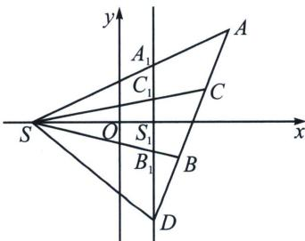
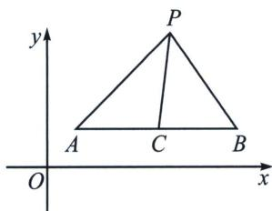
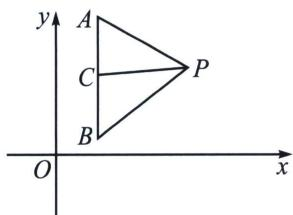

## 二、调和线束斜率公式

调和线束的斜率关系：若 $l_{1}, l_{3}; l_{2}, l_{4}$ 是调和线束，则它们的斜率满足 $\frac{1}{k_1 - k_3} + \frac{1}{k_1 - k_4} = \frac{2}{k_1 - k_2}$ ，或者

$$
2 (k _ {1} k _ {2} + k _ {3} k _ {4}) = (k _ {1} + k _ {2}) (k _ {3} + k _ {4})
$$

若直线 SA, SB, SC, SD 为调和线束，(AB, CD) = -1，且斜率均存在，则 $\frac{1}{k_{SA} - k_{SC}} + \frac{1}{k_{SA} - k_{SD}} = \frac{2}{k_{SA} - k_{SB}}$ .

证明: (交比不变性)如图, 过 $D$ 作 $x$ 轴的垂线与 $x$ 轴交于 $S_{1}$ , 另外交 $SA$ , $SC$ , $SB$ 于 $A_{1}$ , $C_{1}$ , $B_{1}$ 点. 由交比不变性可知, $(A_{1}B_{1}, C_{1}D) = -1: \frac{1}{A_{1}C_{1}} + \frac{1}{A_{1}D} = \frac{2}{A_{1}B_{1}}$ , 分母同除以 $SS_{1}$ :

$$
\frac {1}{\frac {A _ {1} S _ {1} - C _ {1} S _ {1}}{S S _ {1}}} + \frac {1}{\frac {A _ {1} S _ {1} + S _ {1} D}{S S _ {1}}} = \frac {2}{\frac {A _ {1} S _ {1} + S _ {1} B _ {1}}{S S _ {1}}} \Leftrightarrow \frac {1}{k _ {A S} - k _ {S C}} + \frac {1}{k _ {A S} - k _ {S D}} = \frac {2}{k _ {S A} - k _ {S B}}.
$$

$\frac{1}{k_{1}-k_{3}}+\frac{1}{k_{1}-k_{4}}=\frac{2}{k_{1}-k_{2}}$ 去分母得： $2(k_{1}k_{2}+k_{3}k_{4})=(k_{1}+k_{2})(k_{3}+k_{4})$

特殊的，当 $k_{4} \to \infty$ 时， $(ab, cd) = \frac{k_{3} - k_{1}}{1 - \frac{k_{1}}{k_{4}}} \cdot \frac{1 - \frac{k_{2}}{k_{4}}}{k_{3} - k_{2}} = \frac{k_{3} - k_{1}}{1 - 0} \cdot \frac{1 - 0}{k_{3} - k_{2}} = -1$ ，即 $k_{1} + k_{2} = 2k_{3}$ ；

同理，当 $k_{4} = 0$ 时，则有 $\frac{1}{k_1} +\frac{1}{k_2} = \frac{2}{k_3}$ 这就是的斜率等差或者斜率倒数等差模型

本章内容结合这两个定理展开，打开极点极线背景的新世界.

1. 平行于坐标系的中点斜率翻译

如图，PC 为 $\triangle PAB$ 的中线，设直线 AP，BP，CP 的斜率分别为 $k_{1}$ ， $k_{2}$ ， $k_{3}$ ，

①若 AB 与 x 轴平行，则： $\frac{1}{k_{1}}+\frac{1}{k_{2}}=\frac{2}{k_{3}}$ ；②若 AB 与 y 轴平行，则： $k_{1}+k_{2}=2k_{3}$ .

证明：①设 $y_{P}-y_{A}=y_{P}-y_{B}=y_{P}-y_{C}=\Delta y,\quad\frac{1}{k_{1}}+\frac{1}{k_{2}}=\frac{x_{P}-x_{A}}{\Delta y}+\frac{x_{P}-x_{B}}{\Delta y},\quad\frac{2}{k_{3}}=2\quad\frac{x_{P}-x_{C}}{\Delta y}=$ $\frac{2x_{P}-x_{A}-x_{B}}{\Delta y}$ ，所以 $\frac{1}{k_{1}}+\frac{1}{k_{2}}=\frac{2}{k_{3}}$ ;

②设 $x_{P}-x_{A}=x_{P}-x_{B}=x_{P}-x_{C}=\Delta x,\quad k_{1}+k_{2}=\frac{y_{P}-y_{A}}{\Delta x}+\frac{y_{P}-y_{B}}{\Delta x},\quad 2k_{3}=2\frac{y_{P}-y_{C}}{\Delta x}=\frac{2y_{P}-y_{A}-y_{B}}{\Delta x}$ ，所以 $k_{1}+k_{2}=2k_{3}$ .

注意 这两个斜率公式考试中可以直接用，无需额外证明.

![[高中/总复习/专题/2026版高中《mst老唐说题》圆锥曲线专题（数学）/下册/第12章_调和点列与调和线束定理与对合关系/第二节_调和线束两大定理的应用/二_调和线束斜率公式/例题/Q00048966.md]]
![[高中/总复习/专题/2026版高中《mst老唐说题》圆锥曲线专题（数学）/下册/第12章_调和点列与调和线束定理与对合关系/第二节_调和线束两大定理的应用/二_调和线束斜率公式/例题/Q00048818.md]]
![[高中/总复习/专题/2026版高中《mst老唐说题》圆锥曲线专题（数学）/下册/第12章_调和点列与调和线束定理与对合关系/第二节_调和线束两大定理的应用/二_调和线束斜率公式/例题/Q00048819.md]]
![[高中/总复习/专题/2026版高中《mst老唐说题》圆锥曲线专题（数学）/下册/第12章_调和点列与调和线束定理与对合关系/第二节_调和线束两大定理的应用/二_调和线束斜率公式/例题/Q00048820.md]]
![[高中/总复习/专题/2026版高中《mst老唐说题》圆锥曲线专题（数学）/下册/第12章_调和点列与调和线束定理与对合关系/第二节_调和线束两大定理的应用/二_调和线束斜率公式/例题/Q00048821.md]]
![[高中/总复习/专题/2026版高中《mst老唐说题》圆锥曲线专题（数学）/下册/第12章_调和点列与调和线束定理与对合关系/第二节_调和线束两大定理的应用/二_调和线束斜率公式/例题/Q00048822.md]]
![[高中/总复习/专题/2026版高中《mst老唐说题》圆锥曲线专题（数学）/下册/第12章_调和点列与调和线束定理与对合关系/第二节_调和线束两大定理的应用/二_调和线束斜率公式/例题/Q00048823.md]]
![[高中/总复习/专题/2026版高中《mst老唐说题》圆锥曲线专题（数学）/下册/第12章_调和点列与调和线束定理与对合关系/第二节_调和线束两大定理的应用/二_调和线束斜率公式/例题/Q00048824.md]]
![[高中/总复习/专题/2026版高中《mst老唐说题》圆锥曲线专题（数学）/下册/第12章_调和点列与调和线束定理与对合关系/第二节_调和线束两大定理的应用/二_调和线束斜率公式/例题/Q00048825.md]]
![[高中/总复习/专题/2026版高中《mst老唐说题》圆锥曲线专题（数学）/下册/第12章_调和点列与调和线束定理与对合关系/第二节_调和线束两大定理的应用/二_调和线束斜率公式/例题/Q00048826.md]]
![[高中/总复习/专题/2026版高中《mst老唐说题》圆锥曲线专题（数学）/下册/第12章_调和点列与调和线束定理与对合关系/第二节_调和线束两大定理的应用/二_调和线束斜率公式/例题/Q00048827.md]]
