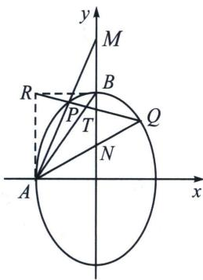
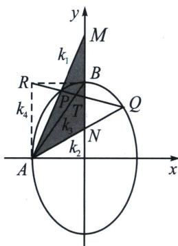

<!-- question-source:start -->
例12 (2023·乙卷)已知椭圆 $C: \frac{y^2}{a^2} + \frac{x^2}{b^2} = 1 (a > b > 0)$ 的离心率为 $\frac{\sqrt{5}}{3}$ , 点 $A(-2, 0)$ 在 $C$ 上.

(1)求 $C$ 的方程;

(2) 过点 $(-2, 3)$ 的直线交 C 于点 P, Q 两点，直线 AP, AQ 与 y 轴的交点分别为 M, N，证明：线段 MN 的中点为定点.

(1)椭圆 $C$ 的方程为 $\frac{y^2}{9} +\frac{x^2}{4} = 1$

(2)极点极线背景分析: 本题给到定点 $R(-2,3)$ 作为极点, 我们求出它的极线方程 $\frac{-2x}{4} + \frac{3y}{9} = 1$ , 如图, 即是过椭圆左顶点 $A$ 和上顶点 $B$ 的连线, 设 $AB$ 与 $PQ$ 交于点 $T$ , 则 $R, P, T, Q$ 是调和点列, 因为 $AR // y$ 轴, 我们分别用坐标和斜率两个角度来分析.

方案一：如左图，由调和点列的平行中点定理，按照交比不变性分析，以 A 作为射影中心， $A(RT, PQ)=A(\infty, B; M, N)=-1$ ，所以 BM=BN.

方案二：如右图，由于 R, P, T, Q 是调和点列，则 AP、AQ、AB、AR 为调和线束，分别记它们斜率为 $k_{1}$ 、 $k_{2}$ 、 $k_{3}$ 、 $k_{4}$ ，由于 $k_{4}=\infty$ ，所以 $k_{1}+k_{2}=2k_{3}=3$ ，再分析与 y 轴平行的 $\triangle AMN$ ，且 $k_{AM}+k_{AN}=2k_{AB}$ ，根据中点斜率公式可知 BM=BN.

综合方案一和二，方案一在解读调和点列时，由于极点 R 不在坐标轴上，利用定比点差解读需要更大的计算量，而按照斜率角度来解读，直接将 A 移到原点构造齐次化(斜率对合)方程，本题就可以轻松拿到结果，故本题最佳解答方法为齐次化.
<!-- question-source:end -->

![[高中/总复习/专题/2026版高中《mst老唐说题》圆锥曲线专题（数学）/下册/第12章_调和点列与调和线束定理与对合关系/第二节_调和线束两大定理的应用/二_调和线束斜率公式/例题/answers/Q00048818A1.md]]
