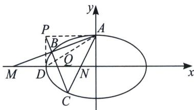
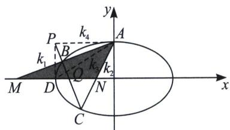

<!-- question-source:start -->
例13 (2022·北京卷)已知椭圆 $E: \frac{x^2}{a^2} + \frac{y^2}{b^2} = 1 (a > b > 0)$ 的一个顶点为 $A(0, 1)$ ，焦距为 $2\sqrt{3}$ .

(1)求椭圆 E 的方程

(2)过点 $P(-2,1)$ 作斜率为 k 的直线与椭圆 E 交于不同的两点 B, C, 直线 AB, AC 分别与 x 轴交于点 M, N. 当 $|MN|=2$ 时，求 k 的值.

## 解析
(1) $\frac{x^2}{4} + y^2 = 1$

(2)极点极线背景分析: 本题给到极点 $P(-2, 1)$ , 我们求出它的极线方程 $\frac{-2x}{4} + y = 1$ , 如左图, 即是过椭圆左顶点 $D$ 和上顶点 $A$ 的连线, 设 $AD$ 与 $BC$ 交于点 $Q$ , 则 $P, B, Q, C$ 是调和点列, 因为 $AP \parallel x$ 轴,

方案一：由调和点列的平行中点定理知 $A(P, Q; B, C) = A(\infty, D; M, N) = -1$ ，所以 MD = DN，

又因为 $|MN| = 2$ 由此知 $M$ 点的坐标为 $(-3,0)$ ，故 $AB: y = \frac{1}{3} x + 1$ ，联立 $\left\{ \begin{array}{l} \frac{x^2}{4} + y^2 = 1 \\ y = \frac{1}{3} x + 1 \end{array} \right.$ ，易解得 $x_B = -\frac{24}{13}$ ，

$$
y _ {B} = \frac {5}{1 3}, k = \frac {1 - \frac {5}{1 3}}{- 2 + \frac {2 4}{1 3}} = - 4.
$$

方案二：如右图，由于 P, Q, B, C 是调和点列，则 AB、AC、AQ、AP 为调和线束，分别记它们斜率为 $k_{1}$ 、 $k_{2}$ 、 $k_{3}$ 、 $k_{4}$ ，由于 $k_{4}=0$ ，所以 $\frac{1}{k_{1}}+\frac{1}{k_{2}}=\frac{2}{k_{3}}=4$ ，再分析与 x 轴平行的 $\triangle AMN$ ，且 $\frac{1}{k_{AM}}+\frac{1}{k_{AN}}=\frac{2}{k_{AD}}$ ，根据中点斜率公式可知 DM=DN，求出 M 或者 N 的坐标后联立，也可以直接利用斜率齐次化方程直接构造， $|MN|=\left|\frac{1}{k_{1}}-\frac{1}{k_{2}}\right|=\sqrt{\left(\frac{1}{k_{1}}+\frac{1}{k_{2}}\right)^{2}-\frac{4}{k_{1}k_{2}}}=2$ ，从而算出 $k_{1}k_{2}$ ，从而得到 k，本题最优解答就是齐次化，计算量小.
<!-- question-source:end -->

![[高中/总复习/专题/2026版高中《mst老唐说题》圆锥曲线专题（数学）/下册/第12章_调和点列与调和线束定理与对合关系/第二节_调和线束两大定理的应用/二_调和线束斜率公式/例题/answers/Q00048819A1.md]]
