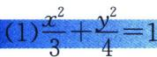
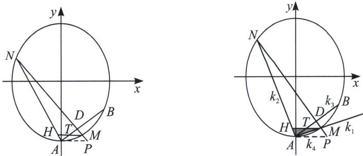

<!-- question-source:start -->
例14（2022·全国乙卷）已知椭圆 E 的中心为坐标原点，对称轴为 x 轴、y 轴，且过 A(0, -2)，B(3/2, -1)两点.

(1)求 E 的方程;

(2)设过点 $P(1, -2)$ 的直线交 $E$ 于 $M, N$ 两点, 过 $M$ 且平行于 $x$ 轴的直线与线段 $A B$ 交于点 $T$ , 点 $H$ 424 老唐说题

满足 $\overrightarrow{MT}=\overrightarrow{TH}$ . 证明：直线 HN 过定点.

(2)极点极线背景
<!-- question-source:end -->

![[高中/总复习/专题/2026版高中《mst老唐说题》圆锥曲线专题（数学）/下册/第12章_调和点列与调和线束定理与对合关系/第二节_调和线束两大定理的应用/二_调和线束斜率公式/例题/answers/Q00048820A1.md]]
