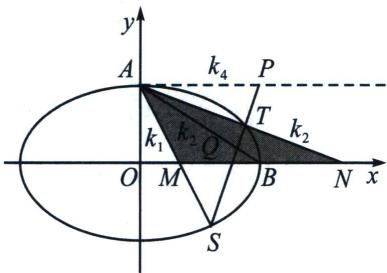
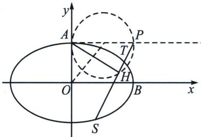

<!-- question-source:start -->
例15（广州24届12月调研）在平面直角坐标系 $xOy$ 中，点 $F(-\sqrt{3}, 0)$ ，点 $D(x, y)$ 是平面内的动点。若 $DF$ 为直径的圆与圆 $O: x^{2} + y^{2} = 4$ 内切，记点 $D$ 的轨迹为曲线 $E$

(1) 求 E 的方程;

(2) 设点 $A(0, 1)$ , $M(t, 0)$ , $N(4 - t, 0) (t \neq 2)$ , 直线 $AM$ , $AN$ 分别与曲线 $E$ 交于点 $S$ , $T(S, T$ 异于 $A)$ $AH \perp ST$ , 垂足为 $H$ , 求 $|OH|$ 的最小值.

(2)极点极线背景: 如图, 记椭圆右顶点 $B(2,0)$ , $AB$ 交 $ST$ 于 $Q$ , 由于 $M(t,0)$ , $N(4-t,0)$ , 显然

## 高中数学 新思路 圆锥专题

MB=BN，过A作MN的平行线，交ST于P，连接AB交ST于Q，

方案一：根据交比不变性，以 $A$ 作为射影中心，根据调和线束平行中点的逆定理可知， $A(M, N; B, \infty) = A(S, T; H, P) = -1$ ，所以 $AS, AT, AQ, AP$ 为调和线束， $S, T, Q, P$ 为调和点列，即得到直线 $AB$ 为 $P$ 点的极线。从而 $P(2, 1)$ .

方案二: 由于 $BM = BN$ , 斜率翻译与 $x$ 轴平行的 $\triangle AMN$ , $\frac{1}{k_{AM}} + \frac{1}{k_{AN}} = \frac{2}{k_{AB}}$ , $AM$ 、 $AN$ 、 $AB$ 、 $AP$ 分别记它们斜率为 $k_{1}$ 、 $k_{2}$ 、 $k_{3}$ 、 $k_{4}$ , 由于 $\frac{1}{k_{1}} + \frac{1}{k_{2}} = \frac{2}{k_{3}} = -4$ , 根据调和线束斜率公式可知, 一定存在 $k_{4} = 0$ , 所以 $P$ 在椭圆上顶点的切线上, 且满足 $P$ , $Q$ , $B$ , $C$ 是调和点列, 则直线 $AB$ 为 $P$ 点的极线, 从而 $P(2,1)$ .

因此点 H 在以 $(1, 1)$ 为圆心，1 为半径的圆周上运动，所以 $\left|OH\right|_{\min} = \sqrt{2} - 1$ .
<!-- question-source:end -->

![[高中/总复习/专题/2026版高中《mst老唐说题》圆锥曲线专题（数学）/下册/第12章_调和点列与调和线束定理与对合关系/第二节_调和线束两大定理的应用/二_调和线束斜率公式/例题/answers/Q00048821A1.md]]
