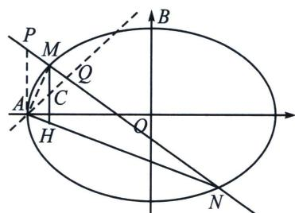

<!-- question-source:start -->
例16（福建24届高三名校联盟T19）已知椭圆 $E$ 的方程为 $\frac{x^2}{a^2} +\frac{y^2}{b^2} = 1(a > b > 0)$ ， $A$ 为 $E$ 的左顶点， $B$ 为 $E$ 的上顶点， $E$ 的离心率为 $\frac{1}{2}$ ， $\triangle ABO$ 的面积为 $\sqrt{3}$

(1)求 E 的方程;

(2) 过点 $P(-2, 1)$ 的直线交 $E$ 于 $M$ 、 $N$ 两点，过点 $M$ 且垂直于 $x$ 轴的直线交直线 $AN$ 于点 $H$ ，证明：线段 $MH$ 的中点在定直线上.

(2)极点极线背景
<!-- question-source:end -->

![[高中/总复习/专题/2026版高中《mst老唐说题》圆锥曲线专题（数学）/下册/第12章_调和点列与调和线束定理与对合关系/第二节_调和线束两大定理的应用/二_调和线束斜率公式/例题/answers/Q00048822A1.md]]
