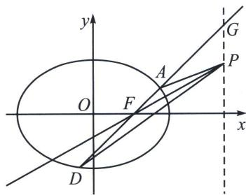

<!-- question-source:start -->
例17 (2024·陕西模拟)已知椭圆 $C: \frac{x^{2}}{a^{2}} + \frac{y^{2}}{b^{2}} = 1 (a > b > 0)$ 的右焦点为 $F$ , 离心率为 $\frac{1}{2}$ , $A$ 为椭圆上一点, $O$ 为坐标原点, 直线 $OA$ 与椭圆交于另一点 $B$ , 直线 $AF$ 与椭圆交于另一点 $D$ (与点 $B$ 不重合), $\triangle ABF$ 面积的最大值为 $\sqrt{3}$ .

(1)求椭圆 C 的标准方程;

(2) 点 P 为直线 x=4 上一点，记 PA, PF, PD 的斜率分别为 $k_{1}$ , $k_{2}$ , $k_{3}$ ，若 $k_{1}+2k_{2}+k_{3}=4$ ，求点 P 的坐标.

(1)椭圆 $C$ 的标准方程为 $\frac{x^2}{4} +\frac{y^2}{3} = 1.$

(2)极点极线背景分析：由于 F 为极点，其对应极线方程为 x=4，故根据斜率等差模型得： $k_{1}+2k_{2}+k_{3}=4k_{2}=4$ ，所以 $P(4,3)$ .

(2)椭圆或双曲线 $\frac{x^{2}}{a^{2}}\pm\frac{y^{2}}{b^{2}}=1$ 中，设直线AB与椭圆或双曲线交于A、B两点，且直线AB与y轴的交点为 $N(0,n)$ ，点N均不是椭圆上下顶点。若P是直线 $y=\frac{b^{2}}{n}$ 上任一点，则 $\frac{1}{k_{PA}}+\frac{1}{k_{PB}}=\frac{2}{k_{PN}}$ 。

证明：如图，由于 $y_{N}y_{P}=y_{M}y_{N}=b^{2}$ ，故 A, B, N, M 是调和点列，则 PA、PB、PN、PM 为调和线束，分别记它们斜率为 $k_{1}$ 、 $k_{2}$ 、 $k_{3}$ 、 $k_{4}$ ，由于 $k_{4}=0$ ，所以 $\frac{1}{k_{1}}+\frac{1}{k_{2}}=\frac{2}{k_{3}}$ ，
<!-- question-source:end -->

![[高中/总复习/专题/2026版高中《mst老唐说题》圆锥曲线专题（数学）/下册/第12章_调和点列与调和线束定理与对合关系/第二节_调和线束两大定理的应用/二_调和线束斜率公式/例题/answers/Q00048823A1.md]]
