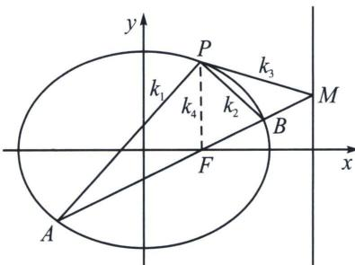

<!-- question-source:start -->
例19（2013·江西理）如图，椭圆 $C: \frac{x^2}{a^2} + \frac{y^2}{b^2} = 1 (a > b > 0)$ 经过点 $P\left(1, \frac{3}{2}\right)$ ，离心率 $e = \frac{1}{2}$ ，直线 $l$ 的方程为 $x = 4$ .

(1)求椭圆 C 的方程;

(2)AB 是经过右焦点 F 的任一弦(不经过点 P)，设直线 AB 与直线 l 相交于点 M，记 PA，PB，PM 的斜率分别为 $k_{1}$ ， $k_{2}$ ， $k_{3}$ 。问：是否存在常数 $\lambda$ ，使得 $k_{1} + k_{2} = tk_{3}$ ？若存在，求 $\lambda$ 的值；若不存在，说明理由。

## 解析
(1) $\frac{x^{2}}{4}+\frac{y^{2}}{3}=1;$

(2)极点极线背景: 连接 $PF$ , 易知 $A 、 F 、 B 、 M$ 为调和点列, 根据调和线束斜率公式, 以 $P$ 为射影中心, $PA 、 PB 、 PF 、 PM$ 为调和线束, 由于 $k_{4} = k_{PF} = \infty$ , 故 $k_{PA} + k_{PB} = 2k_{PM}$ , 即 $k_{1} + k_{2} = 2k_{3}$ .
<!-- question-source:end -->

![[高中/总复习/专题/2026版高中《mst老唐说题》圆锥曲线专题（数学）/下册/第12章_调和点列与调和线束定理与对合关系/第二节_调和线束两大定理的应用/二_调和线束斜率公式/例题/answers/Q00048825A1.md]]
