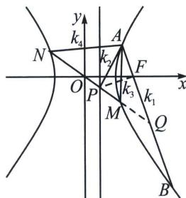

<!-- question-source:start -->
例21（2023·石家庄二模）已知双曲线 $\Gamma: x^{2}-\frac{y^{2}}{3}=1$ ，F 为双曲线 $\Gamma$ 的右焦点，过 F 作直线 $l_{1}$ 交双曲线 $\Gamma$ 于 A，B 两点，过 F 点且与直线 $l_{1}$ 垂直的直线 $l_{2}$ 交直线 $x=\frac{1}{2}$ 于 P 点，直线 OP 交双曲线 $\Gamma$ 于 M，N 两点.
(1)若直线 OP 的斜率为 $\frac{3}{2}$ ，求 $|AB|$ 的值；

(2)设直线 AB, AP, AM, AN 的斜率分别为 $k_{1}$ , $k_{2}$ , $k_{3}$ , $k_{4}$ ，且 $k_{1}k_{2}k_{3}k_{4}\neq0$ , $k_{1}+k_{2}\neq0$ ，记 $k_{1}+k_{2}=u$ , $k_{1}k_{2}=v$ , $k_{3}+k_{4}=w$ ，试探究 v 与 u，w 满足的方程关系，并将 v 用 w，u 表示出来.

(1) 设 $A(x_0, y_0)$ , $B(x_2, y_2)$ , $F(2, 0)$ , 由题意知 $P$ 为 $\left(\frac{1}{2}, \frac{3}{4}\right)$ , 则直线 $l_2$ 斜率为 $k_{l_2} = -\frac{1}{2}$ , 所以直线 $l_1$ 的斜率为 $k = 2$ , 故直线 $l_1$ 的方程为: $y = 2(x - 2)$ ; 联立直线 $l_1$ 和曲线 $\Gamma$ : $\left\{ \begin{array}{l} y = 2(x - 2) \\ x^2 - \frac{y^2}{3} = 1 \end{array} \Rightarrow x^2 - 16x + 19 = 0, \text{显然} \triangle > 0, \text{此方程的两根为 } x_0, x_2, \right.$

由韦达定理得： $x_{0}+x_{2}=16,\quad x_{0}x_{2}=19$ ，所以 $|AB|=\sqrt{1+k^{2}}\sqrt{(x_{0}+x_{2})^{2}-4x_{0}x_{2}}=30;$

(2)极点极线背景分析: 延长 $NM$ 交 $AB$ 于 $Q$ , 由于 $x_{P}x_{F}=1$ , $PF \perp AB$ , 则 $Q$ 在点 $P$ 对应的极线上, (或者令 $P\left(\frac{1}{2}, t\right)$ 其对应极线为: $x_{P}x_{Q}-\frac{y_{P}y_{Q}}{3}=1$ , 即 $\frac{1}{2}x_{Q}-\frac{ty_{Q}}{3}=1$ , $PF \perp AB$ , 故 $k_{AB}=\frac{3}{2t}$ , 所以 $AB: y=\frac{3}{2t}(x-2)$ , 即 $\frac{1}{2}x-\frac{ty}{3}=1$ , 与 $P$ 点对应的极线为同一条直线)故 ( $NM$ , $PQ$ ) = -1, 根据调和线束斜率关系, $2(k_{1}k_{2}+k_{3}k_{4})=(k_{1}+k_{2})(k_{3}+k_{4})$ , 根据第三定义, $k_{3}k_{4}=3$ , 所以 $v=\frac{1}{2}uw-3$ .
<!-- question-source:end -->

![[高中/总复习/专题/2026版高中《mst老唐说题》圆锥曲线专题（数学）/下册/第12章_调和点列与调和线束定理与对合关系/第二节_调和线束两大定理的应用/二_调和线束斜率公式/例题/answers/Q00048827A1.md]]
