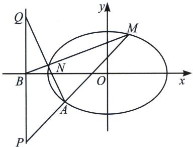
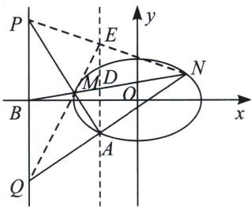

<!-- question-source:start -->
例①（2020·北京）已知椭圆 $C: \frac{x^2}{a^2} + \frac{y^2}{b^2} = 1$ 过点 $A(-2, -1)$ ，且 $a = 2b$ .

(1)求椭圆 C 的方程;

(2) 过点 $B(-4, 0)$ 的直线 l 交椭圆 C 于点 M, N, 直线 MA, NA 分别交直线 x = -4 于点 P, Q. 求 $\frac{|PB|}{|BQ|}$ 的值.

(1) $\frac{x^2}{8} + \frac{y^2}{2} = 1$ ;

(2)极点极线背景分析：

方案一：可以理解为半梯形调和平行弦，我们也可以将其还原成调和梯形，以 $B(-4,0)$ 为极点，其对应极线为直线 $x = -2$ ，即直线 $AD$ ，如右图所示，连接 $QM$ 并延长交 $AD$ 于 $E$ ，由于 $B,M,D,N$ 这四点是调和点列，则 $P,E,N$ 三点共线，且 $AD = DE$ ， $PB = BQ$ 。也可以将 $A$ 作为射影中心， $A(B,D;M,N) = -1$ ，由于 $PQ // AD$ ，利用调和线束平行中点定理，故 $A(B,D;M,N) = A(B,\infty;P,Q) = -1$ ，所以 $|PB| = |BQ|$ 。
<!-- question-source:end -->

![[高中/总复习/专题/2026版高中《mst老唐说题》圆锥曲线专题（数学）/下册/第12章_调和点列与调和线束定理与对合关系/第二节_调和线束两大定理的应用/二_调和线束斜率公式/例题/answers/Q00048966A1.md]]
