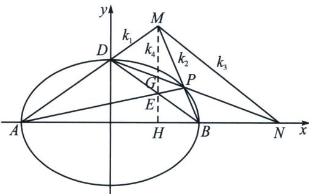

<!-- question-source:start -->
例20 (2013·江西文)椭圆 $C: \frac{x^2}{a^2} + \frac{y^2}{b^2} = 1 (a > b > 0)$ 的离心率为 $e = \frac{\sqrt{3}}{2}, a + b = 3$ .

(1)求椭圆 C 的方程;

(2)如图, $A$ , $B$ , $D$ 是椭圆 $C$ 的顶点, $P$ 是椭圆 $C$ 上除顶点外的任意点, 直线 $DP$ 交 $x$ 轴于 $N$ 直线 $AD$ 交 $BP$ 于点 $M$ , 设 $BP$ 的斜率为 $k$ , $MN$ 的斜率为 $m$ , 证明为 $2m - k$ 为定值.

##
<!-- question-source:end -->

![[高中/总复习/专题/2026版高中《mst老唐说题》圆锥曲线专题（数学）/下册/第12章_调和点列与调和线束定理与对合关系/第二节_调和线束两大定理的应用/二_调和线束斜率公式/例题/answers/Q00053178A1.md]]
