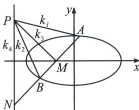

> [!faq]- 《圆锥曲线专题(下册)》例题解析
>
> > [!success]- **【答案】** 详见解析
>
> > [!note]- **【分析】**
> > 如图, 设点 $P$ 的极线 $\frac{x}{-2} + \frac{y}{3} = 1$ 与 $MN$ 交于点 $Q$ , 则直线 $AP$ , $AM$ , $AQ$ , $AN$ 为调和线束, 又 $MH \parallel AP$ , 根据交比不变性, $A(P, Q; M, N) = A(\infty, C; M, H) = -1$ , 则 $MH$ 的中点在直线 $AQ$ 上, 即在点 $P$ 的极线上.
>
> > [!note]- **【解析】**
> > 解答书写过程：
> > 将椭圆按照向量 $\overrightarrow{AO}=(2,0)$ 平移，得 $\frac{(x-2)^{2}}{4}+\frac{y^{2}}{3}=1$ ，即 $\frac{x^{2}}{4}+\frac{y^{2}}{3}-x=0$ ，此时 $M\rightarrow M^{\prime},N\rightarrow N^{\prime},M^{\prime}N^{\prime}$ 过定点 $P^{\prime}(0,1)$ ，所以 $M^{\prime}N^{\prime}:mx+y=1$ ，联立 $\frac{x^{2}}{4}+\frac{y^{2}}{3}-x(mx+y)=0$ ，由于 $x\neq0$ ，同除以 $x^{2}$ 得： $\frac{1}{3}\frac{y^{2}}{x^{2}}-\frac{y}{x}+\frac{1}{4}-m=0,k_{AM}+k_{AN}=3$ ，由于C为AH中点，且A、H、N三点共线，故 $k_{AM}+k_{AH}=2k_{AC}=3$ ，所以C在定直线 $y=\frac{3}{2}(x+2)$ 上.
> > ## 2. 斜率等差与斜率倒数等差模型
> > (1)椭圆或双曲线 $\frac{x^{2}}{a^{2}}\pm\frac{y^{2}}{b^{2}}=1$ 中，设直线AB与椭圆或双曲线交于A、B两点，且直线AB与x轴的交点为 $M(m,0)$ 、点M和不是椭圆左右顶，点P在直线 $x=\frac{a^{2}}{m}$ 上，则 $k_{PA}+k_{PB}=2k_{PM}$ ;
> > 
> > 证明：如图，由于 $x_{P}x_{M} = a^{2}$ ，则 $P$ 在以 $M(m,0)$ 为极点的极线上，延长 $AB$ 交直线 $x = \frac{a^2}{m}$ 于 $N$ ，则 $(A, B; M, N) = -1$ ，则 $PA, PB, PM, PN$ 为调和线束，分别记它们斜率为 $k_{1}, k_{2}, k_{3}, k_{4}$ ，由于 $k_{4} = \infty$ ，所以 $k_{1} + k_{2} = 2k_{3}$ ；
