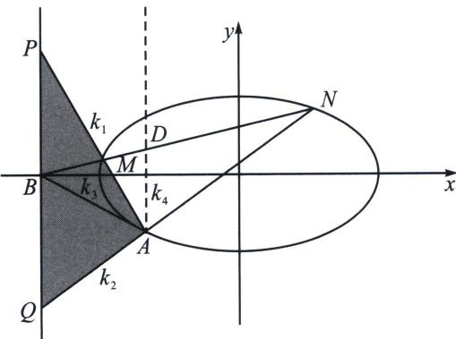

> [!faq]- 《圆锥曲线专题(下册)》例题解析
>
> > [!success]- **【答案】** 详见解析
>
> > [!note]- **【分析】**
> > 本题未单列分析。
>
> > [!note]- **【解析】**
> > 解析
> > 解答过程(定比点差): 令 $\overrightarrow{MB} = \lambda \overrightarrow{BN}$ , 设 $M(x_{1}, y_{1}), N(x_{2}, y_{2})$ , 根据定比点差法(略)可得: $x_{1} = -3 - \lambda, x_{2} = -3 - \frac{1}{\lambda}, y_{1} + \lambda y_{2} = 0$ 所以 $AQ: \frac{y_{Q} + 1}{-2} = \frac{y_{2} + 1}{-1 - \frac{1}{\lambda}} = \frac{\lambda y_{2} + \lambda}{-1 - \lambda}$ ①, $AP: \frac{y_{p} + 1}{-2} = \frac{y_{1} + 1}{-1 - \lambda}$ ②,
> > - **①**：+②得： $\frac{y_{Q}+1}{-2}+\frac{y_{P}+1}{-2}=-1$ ，即 $y_{P}+y_{Q}=0$ ，所以 $\frac{|PB|}{|BQ|=1}$ .
> > 方案二： $A(B, D; M, N) = -1$ ，则 AM、AN、AB、AD 为调和线束，分别记它们斜率为 $k_{1}$ 、 $k_{2}$ 、 $k_{3}$ 、 $k_{4}$ ，由于 $k_{4} = \infty$ ，所以根据调和线束的斜率公式可得： $k_{1} + k_{2} = 2k_{3} = -1$ ，再分析与 y 轴平行的 $\triangle APQ$ ，且 $k_{AP} + k_{AQ} = 2k_{AB}$ ，故 B 为 PQ 中点.
> > 
> > 解答过程(齐次化): 要证 $|BP| = |BQ|$ 只需证 $k_{AP} + k_{AQ} = 2k_{AB} = -1$ , 将椭圆按照向量 $\overrightarrow{AO} = (2, 1)$ 平移, 则 $\frac{(x-2)^2}{8} + \frac{(y-1)^2}{2} = 1$ , 即 $\frac{x^2}{8} + \frac{y^2}{2} - \frac{x}{2} - y = 0$ , $M \to M'$ , $N \to N'$ , 令 $M'N'$ : $mx + ny = 1$ , 代入 $B'(-2, 1)$ 得: $n = 1 + 2m$ , 联立得: $\frac{x^2}{8} + \frac{y^2}{2} - \left(\frac{x}{2} + y\right)(mx + ny) = 0$ , 同除以 $x^2$ 得: $\left(\frac{1}{2} - n\right)\left(\frac{y}{x}\right)^2 -$ $\left(m + \frac{n}{2}\right)\left(\frac{y}{x}\right) + \frac{1}{8} - \frac{m}{2} = 0, k_{AP} + k_{AQ} = \frac{m + \frac{n}{2}}{\frac{1}{2} - n} = -1 = 2k_{AB}$ ，故 $|BP| = |BQ|$ .
> > 注意 本题定比点差更好分析，但是翻译斜率也是高考参与考生一种必备能力，齐次化和定比点差计算量都不大，都可以推荐.
