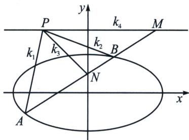

> [!faq]- 《圆锥曲线专题(下册)》例题解析
>
> > [!success]- **【答案】** 详见解析
>
> > [!note]- **【分析】**
> > 由于 F 为极点，其对应极线方程为 x=4，故根据斜率等差模型得： $k_{1}+2k_{2}+k_{3}=4k_{2}=4$ ，所以 $P(4,3)$ .
>
> > [!note]- **【解析】**
> > 解答书写过程:
> > 令 $F(1,0)$ ， $\overrightarrow{AF} = \lambda \overrightarrow{FD} (\lambda \neq 1)$ ，则在直线 $AD$ 上存在点 $G$ ，满足 $\overrightarrow{AG} = -\lambda \overrightarrow{GD}$ ，所以 $\left\{ \begin{array}{l} \frac{x_A + \lambda x_D}{1 + \lambda} = x_F = 1 \\ \frac{y_A + \lambda y_D}{1 + \lambda} = y_F = 0 \end{array} \right.$
> > $\left\{ \begin{array}{l} \frac{x_A - \lambda x_D}{1 - \lambda} = x_G \\ \frac{y_A - \lambda y_D}{1 - \lambda} = y_G \end{array} \right.$ ，故 $\left\{ \begin{array}{l} \frac{x_A^2}{4} + \frac{y_A^2}{3} = 1 \\ \frac{\lambda^2x_D^2}{4} + \frac{\lambda^2y_D^2}{3} = \lambda^2 \end{array} \right.$ ，两式相减得： $\frac{(x_A + \lambda x_D)(x_A - \lambda x_D)}{4(1 + \lambda)(1 - \lambda)} + \frac{(y_A + \lambda y_D)(y_A - \lambda y_D)}{3(1 + \lambda)(1 - \lambda)} = 1$ ，即 $x_D$
> > =4，所以 $\left\{\begin{aligned}x_{A}+\lambda x_{D}&=1+\lambda \\ x_{A}-\lambda x_{D}&=4(1-\lambda),\\ y_{A}+\lambda y_{D}&=0\end{aligned}\right.$ ， $x_{A}=\frac{5}{2}-\frac{3}{2}\lambda,\quad x_{D}=\frac{5}{2}-\frac{3}{2\lambda},\quad y_{A}+\lambda y_{D}=0,$
> > 令点 $P(x_0, y_0)$ ， $k_{PA} + k_{PD} + 2k_{PF} = \frac{y_A - y_0}{\frac{5}{2} - \frac{3}{2}\lambda - x_0} + \frac{\frac{y_A}{- \lambda} - y_0}{\frac{5}{2} - \frac{3}{2\lambda} - x_0} + \frac{2y_0}{3} = \frac{y_A - y_0}{\left(\frac{5}{2} - x_0\right) - \frac{3}{2}\lambda} + \frac{-y_A - y_0\lambda}{\left(\frac{5}{2} - x_0\right)\lambda - \frac{3}{2}}$ $+ \frac{2y_0}{3} = 4$ ；由于 $k_{PA} + k_{PD} + 2k_{PF} = 4$ ，故最终式子不含 $y_A$ ，局部通分得： $-y_A\left[\left(\frac{5}{2} - x_0\right) - \frac{3}{2}\lambda\right] + y_A\left[\left(\frac{5}{2} - x_0\right)\lambda - \frac{3}{2}\right] = 0$ ，
> > 所以 $y_{A}\left(\frac{5}{2}-x_{0}+\frac{3}{2}\right)(\lambda-1)=0$ ，因为 $\lambda\neq1$ ，所以 $4-x_{0}=0$ ，所以 $x_{0}=4$ ，代回去易知 $y_{0}=3$ .
> > (2)椭圆或双曲线 $\frac{x^{2}}{a^{2}}\pm\frac{y^{2}}{b^{2}}=1$ 中，设直线AB与椭圆或双曲线交于A、B两点，且直线AB与y轴的交点为 $N(0,n)$ ，点N均不是椭圆上下顶点。若P是直线 $y=\frac{b^{2}}{n}$ 上任一点，则 $\frac{1}{k_{PA}}+\frac{1}{k_{PB}}=\frac{2}{k_{PN}}$ 。
> > 
> > 证明：如图，由于 $y_{N}y_{P}=y_{M}y_{N}=b^{2}$ ，故 A, B, N, M 是调和点列，则 PA、PB、PN、PM 为调和线束，分别记它们斜率为 $k_{1}$ 、 $k_{2}$ 、 $k_{3}$ 、 $k_{4}$ ，由于 $k_{4}=0$ ，所以 $\frac{1}{k_{1}}+\frac{1}{k_{2}}=\frac{2}{k_{3}}$ ，
