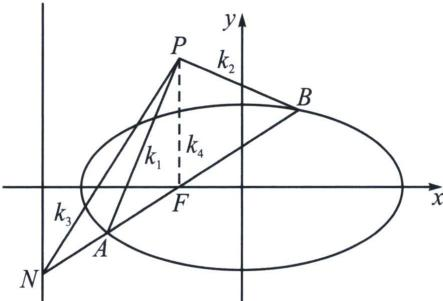

> [!faq]- 《圆锥曲线专题(下册)》例题解析
>
> > [!success]- **【答案】** A
>
> > [!note]- **【解析】**
> > 解析 (1)椭圆 $C$ 的方程为 $\frac{x^2}{4} +\frac{y^2}{3} = 1$
> >
> > (2)设 $P(s,3)$ , $\overrightarrow{AM} = \lambda \overrightarrow{MB}$ , 则存在调和分点 $N(x_0,y_0)$ 满足 $\overrightarrow{AN} = -\lambda \overrightarrow{NB}$ , 根据定比点差法可得 $\frac{x_M x_N}{4} + \frac{y_M y_N}{3} = 1$ , 由于 $x_M = 0$ , 故 $y_N = 3$ , 再根据 $\left\{ \begin{array}{l} y_A + \lambda y_B = (1 + \lambda) \\ y_A - \lambda y_B = 3(1 - \lambda) \end{array} \right.$ , 可得: $y_A = 2 - \lambda$ , $y_B = 2 - \frac{1}{\lambda}$ , $x_A + \lambda x_B = 0$ , $k_1 = \frac{2 - \lambda - 3}{x_A - s} = \frac{-1 - \lambda}{x_A - s}$ , 所以 $\frac{1}{k_1} = \frac{x_A - s}{-1 - \lambda}$ ; 同理: $\frac{1}{k_3} = \frac{x_B - s}{-1 - \frac{1}{\lambda}}$ , $k_2 = \frac{-2}{-s}$ ,
> >
> > $\frac{1}{k_1} + \frac{1}{k_3} = \frac{x_A + \lambda x_B - s - \lambda s}{-1 - \lambda} = s = \frac{2}{k_2}$ ，所以 $\frac{1}{k_1} + \frac{1}{k_3} = \frac{2}{k_2}$ ，故 $\frac{1}{k_1}, \frac{1}{k_2}, \frac{1}{k_3}$ 成等差数列.
> >
> > (3)过圆锥曲线(椭圆、双曲线、抛物线)焦点 F 的任一直线交圆锥曲线于 A、B 两点，交对应准线于点 N，点 P 位于圆锥曲线的通径所在直线上，则 $k_{PA} + k_{PB} = 2k_{PN}$ .
> >
> > 注意：本结论将 F 换成 $M(m,0)$ ，且 $PM \perp x$ 轴，M 与 N 满足调和共轭， $k_{PA} + k_{PB} = 2k_{PN}$ 也成立.
> >
> > 
> >
> > 证明：如图，由于 $x_{F}x_{N} = a^{2}$ ，所以 $(N, F; A, B) = -1$ ，则 $PA$ 、 $PB$ 、 $PN$ 、 $PF$ 为调和线束，分别记它们斜率为 $k_{1}$ 、 $k_{2}$ 、 $k_{3}$ 、 $k_{4}$ ，由于 $k_{4} = \infty$ ，所以 $k_{1} + k_{2} = 2k_{3}$ ；
