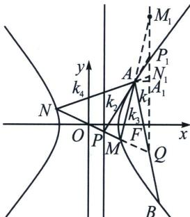

> [!faq]- 《圆锥曲线专题(下册)》例题解析
>
> > [!success]- **【答案】** 详见解析
>
> > [!note]- **【分析】**
> > 延长 $NM$ 交 $AB$ 于 $Q$ , 由于 $x_{P}x_{F}=1$ , $PF \perp AB$ , 则 $Q$ 在点 $P$ 对应的极线上, (或者令 $P\left(\frac{1}{2}, t\right)$ 其对应极线为: $x_{P}x_{Q}-\frac{y_{P}y_{Q}}{3}=1$ , 即 $\frac{1}{2}x_{Q}-\frac{ty_{Q}}{3}=1$ , $PF \perp AB$ , 故 $k_{AB}=\frac{3}{2t}$ , 所以 $AB: y=\frac{3}{2t}(x-2)$ , 即 $\frac{1}{2}x-\frac{ty}{3}=1$ , 与 $P$ 点对应的极线为同一条直线)故 ( $NM$ , $PQ$ ) = -1, 根据调和线束斜率关系, $2(k_{1}k_{2}+k_{3}k_{4})=(k_{1}+k_{2})(k_{3}+k_{4})$ , 根据第三定义, $k_{3}k_{4}=3$ , 所以 $v=\frac{1}{2}uw-3$ .
>
> > [!note]- **【解析】**
> > 解法一(常规设点): 设 $A(x_0, y_0)$ , $M(x_1, y_1)$ , $N(-x_1, -y_1)$ , 则 $k_1 = \frac{y_0}{x_0 - 2}$ ,
> > 因为 $l_{2} \perp l_{1}$ ，故 $l_{2}$ 为 $y = -\frac{1}{k_1}(x - 2)$ ，代入 $x = \frac{1}{2}$ ，得点 $P\left(\frac{1}{2}, \frac{3}{2k_1}\right)$ ，
> > 所以： $k_{2}=\frac{\frac{3}{2k_{1}}-y_{0}}{\frac{1}{2}-x_{0}}=\frac{\frac{3(x_{0}-2)}{2y_{0}}-y_{0}}{\frac{1}{2}-x_{0}}=\frac{3x_{0}-6-2y_{0}^{2}}{(1-2x_{0})y_{0}}$
> > 因为点 $A(x_0, y_0)$ 在双曲线上，故 $x_0, y_0$ 满足双曲线方程，即 $x_0^2 - \frac{y_0^2}{3} = 1 \Rightarrow y_0^2 = 3x_0^2 - 3$
> > 所以 $k_{2} = \frac{3x_{0} - 6 - 2y_{0}^{2}}{(1 - 2x_{0})y_{0}} = \frac{3x_{0}}{y_{0}}$ ，所以 $k_{1} + k_{2} = \frac{y_{0}}{x_{0} - 2} +\frac{3x_{0}}{y_{0}} = \frac{y_{0}^{2} + 3x_{0}(x_{0} - 2)}{(x_{0} - 2)y_{0}} = \frac{6x_{0}^{2} - 6x_{0} - 3}{(x_{0} - 2)y_{0}},$
> > $k_{1}k_{2}=\frac{y_{0}}{x_{0}-2}\cdot\frac{3x_{0}}{y_{0}}=\frac{3x_{0}}{x_{0}-2}$ ，又 $k_{OP}=\frac{y_{P}}{x_{P}}=\frac{3}{k_{1}}$ ，联立直线OP与双曲线C： $\left\{\begin{aligned}y&=\frac{3}{k_{1}}x\\ x^{2}&-\frac{y^{2}}{3}=1\end{aligned}\right.\Rightarrow(k_{1}^{2}-3)x^{2}-k_{1}^{2}=0,$
> > 根据题意易知 $k_{1}^{2} \neq 3$ ，此方程的两根即为 $x_{1}, -x_{1}$ ，所以 $x_{1}^{2} = \frac{k_{1}^{2}}{k_{1}^{2} - 3} = \frac{y_{0}^{2}}{12x_{0} - 15}$ ，
> > $$
> > k _ {3} + k _ {4} = \frac {y _ {1} - y _ {0}}{x _ {1} - x _ {0}} + \frac {- y _ {1} - y _ {0}}{- x _ {1} - x _ {0}} = \frac {2 x _ {1} y _ {1} - 2 x _ {0} y _ {0}}{x _ {1} ^ {2} - x _ {0} ^ {2}} = \frac {\frac {6}{k _ {1}} x _ {1} ^ {2} - 2 x _ {0} y _ {0}}{x _ {1} ^ {2} - x _ {0} ^ {2}} = \frac {\frac {6 (x _ {0} - 2) y _ {0}}{1 2 x _ {0} - 1 5} - 2 x _ {0} y _ {0}}{\frac {y _ {0} ^ {2}}{1 2 x _ {0} - 1 5} - x _ {0} ^ {2}}
> > $$
> > $$
> > = \frac {- 1 2 y _ {0} \left(2 x _ {0} ^ {2} - 3 x _ {0} + 1\right)}{y _ {0} ^ {2} - (1 2 x _ {0} - 1 5) x _ {0} ^ {2}} = \frac {- 1 2 y _ {0} \left(2 x _ {0} ^ {2} - 3 x _ {0} + 1\right)}{- 3 \left(4 x _ {0} ^ {3} - 6 x _ {0} ^ {2} + 1\right)} = \frac {4 y _ {0} (2 x _ {0} - 1) (x _ {0} - 1)}{(2 x _ {0} - 1) (2 x _ {0} ^ {2} - 2 x _ {0} - 1)},
> > $$
> > 即： $k_{3} + k_{4} = \frac{4y_{0}(x_{0} - 1)}{2x_{0}^{2} - 2x_{0} - 1}$ ，所以： $(k_{3} + k_{4})(k_{1} + k_{2}) = \frac{12(x_{0} - 1)}{x_{0} - 2} = 2k_{1}k_{2} + 6,$
> > 即： $v=\frac{1}{2}uw-3.$
> > 解法二(定比点差): 令 $P\left(\frac{1}{2}, t\right)$ , $\overrightarrow{MP} = \lambda \overrightarrow{PN}$ , 则 $\exists Q$ , 使得 $\overrightarrow{MQ} = -\lambda \overrightarrow{QN}$ , 定比点差得: $x_{P} x_{Q} - \frac{y_{P} y_{Q}}{3} = 1$ , 即 $\frac{1}{2} x_{Q} - \frac{t y_{Q}}{3} = 1$ , 故 $Q$ 在直线 $\frac{1}{2} x - \frac{t y}{3} = 1$ 上, $PF \perp A B$ , 故 $k_{A B} = \frac{3}{2 t}$ , 所以 $A B: y = \frac{3}{2 t} (x - 2)$ , 即 $\frac{1}{2} x - \frac{t y}{3} = 1$ , 所以 $Q$ 在直线 $A B$ 上, 故 $\frac{\overrightarrow{MP}}{\overrightarrow{PN}} = -\frac{\overrightarrow{MQ}}{\overrightarrow{QN}} = \lambda$ , $\lambda = \frac{S_{\triangle A P M}}{S_{\triangle A P N}} = \frac{\frac{1}{2} A P \cdot A M \cdot \sin \angle P A M}{\frac{1}{2} A P \cdot A N \cdot \sin \angle P A N} = \frac{A M \cdot \sin \angle P A M}{A N \cdot \sin \angle P A N}$ $\lambda = \frac{S_{\triangle A M Q}}{S_{\triangle A N Q}} = \frac{\frac{1}{2} A Q \cdot A M \cdot \sin \angle Q A M}{\frac{1}{2} A Q \cdot A N \cdot \sin \angle Q A N} = \frac{A M \cdot \sin \angle Q A M}{A N \cdot \sin \angle Q A N}$ , 所以 $\lambda \cdot \frac{1}{\lambda} = \frac{\sin \angle P A M}{\sin \angle P A N} \cdot \frac{\sin \angle Q A N}{\sin \angle Q A M} = 1$
> > 
> > 如图，过 $Q$ 作 $y$ 轴平行线 $l$ ，分别交 $AM$ ， $AP$ ， $AN$ 延长线于 $M_1$ ， $P_1$ ， $N_1$ ，作 $AA_1 \perp l$ 于 $A_1$ ， $\frac{\sin \angle PAM}{\sin \angle PAN} \cdot \frac{\sin \angle QAN}{\sin \angle QAM} = \frac{\overrightarrow{MP}}{\overrightarrow{PN}} \cdot \left(-\frac{\overrightarrow{QN}}{\overrightarrow{MQ}}\right) = \frac{\overrightarrow{M_1P_1}}{\overrightarrow{P_1N_1}} \cdot \left(-\frac{\overrightarrow{QN_1}}{\overrightarrow{M_1Q}}\right) = 1$ ，即 $\frac{k_3 - k_1}{k_4 - k_1} \cdot \frac{k_4 - k_2}{k_3 - k_2} = -1$
> > 故 $2(k_{1}k_{2} + k_{3}k_{4}) = (k_{1} + k_{2})(k_{3} + k_{4})$ ，根据第三定义得： $k_{3}k_{4} = 3$ ，所以 $v = \frac{1}{2} uw - 3.$
> > 注意 证明调和斜率的过程参考证明交比不变性.
