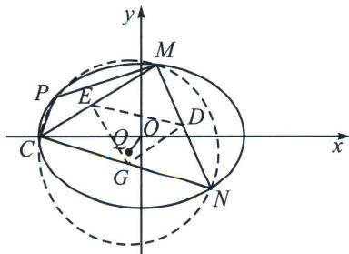

<!-- question-source:start -->
例①（2025届T8联考T18）已知过 $A(-1,0)$ ， $B(1,0)$ 两点的动抛物线的准线始终与圆 $x^{2} + y^{2} = 9$ 相
474 老唐说题

切，该抛物线焦点 P 的轨迹是某圆锥曲线 E 的一部分.

(1)求曲线 E 的标准方程;

(2)已知点 $C(-3,0)$ , $D(2,0)$ , 过点 $D$ 的动直线与曲线 $E$ 交于 $M$ , $N$ 两点, 设 $\triangle CMN$ 的外心为 $Q$ , $O$ 为坐标原点, 问: 直线 $OQ$ 与直线 $MN$ 的斜率之积是否为定值, 如果是定值, 求出该定值; 如果不是定值,说明理由.

(1) $\frac{x^2}{9} + \frac{y^2}{8} = 1$ ;
(2) 直线 $OQ$ 与 $MN$ 的斜率之积为定值 -5.

本题在第一节介绍了同解方程与曲线系解法，本节我们深挖背景

定理：如图，椭圆上内接三角形CMN的外接圆圆心为 $Q$ ，则 $k_{CM}k_{CN}k_{MN}k_{OQ} = \frac{b^2}{a^2}$

证明：解法一（中点弦点差法）：如图，设 CM，CN，MN 的中点分别为点 $E(x_{1}, y_{1})$ ， $G(x_{2}, y_{2})$ ， $D(x_{3}, y_{3})$ ，外接圆圆心 $Q(x_{0}, y_{0})$ ，由点差法知 $k_{CM}k_{OE} = -\frac{b^{2}}{a^{2}}$ ①，由外接圆圆心为中垂线交点知 $k_{CM}k_{OE} = -1$ ②，

①÷②可得 $\frac{k_{OE}}{k_{QE}}=\frac{b^{2}}{a^{2}}\Rightarrow\frac{\frac{y_{1}}{x_{1}}}{\frac{y_{1}-y_{0}}{x_{1}-x_{0}}}=\frac{b^{2}}{a^{2}}$ ，整理得 $c^{2}x_{1}y_{1}+b^{2}y_{0}x_{1}-a^{2}x_{0}y_{1}=0$ ③

同理有 $c^2 x_2y_2 + b^2 y_0x_2 - a^2 x_0y_2 = 0$ ④，③ $\times x_{2}y_{2} - ④ \times x_{1}y_{1}$ 得： $(b^{2}y_{0}x_{1} - a^{2}x_{0}y_{1})x_{2}y_{2} - (b^{2}y_{0}x_{2}-$ $a^2 x_0y_2)x_1y_1 = 0,$

$$
b ^ {2} y _ {0} x _ {1} x _ {2} (y _ {2} - y _ {1}) = a ^ {2} x _ {0} y _ {1} y _ {2} (x _ {2} - x _ {1}) \Rightarrow \frac {x _ {0} y _ {1} y _ {2} (x _ {1} - x _ {2})}{y _ {0} x _ {1} x _ {2} (y _ {1} - y _ {2})} = \frac {b ^ {2}}{a ^ {2}} \Rightarrow \frac {y _ {1}}{x _ {1}} \frac {y _ {2}}{x _ {2}} \frac {x _ {1} - x _ {2}}{y _ {1} - y _ {2}} \frac {x _ {0}}{y _ {0}} = \frac {b ^ {2}}{a ^ {2}},
$$

$$
\mathrm{又} \frac {y _ {1}}{x _ {1}} = k _ {O E} = - \frac {b ^ {2}}{a ^ {2}} \frac {1}{k _ {C M}}, \frac {y _ {2}}{x _ {2}} = k _ {O G} = - \frac {b ^ {2}}{a ^ {2}} \frac {1}{k _ {B C N}}, \frac {y _ {1} - y _ {2}}{x _ {1} - x _ {2}} = k _ {E G} = k _ {M N}, \frac {y _ {0}}{x _ {0}} = k _ {O Q}
$$

所以 $\frac{b^2}{a^2}\frac{1}{k_{CM}}\cdot \frac{b^2}{a^2}\frac{1}{k_{CN}}\cdot \frac{1}{k_{MN}}\cdot \frac{1}{k_{OQ}} = \frac{b^2}{a^2}$ ，即 $k_{CM}k_{CN}k_{MN}k_{OQ} = \frac{b^2}{a^2}$

书写过程：

常规韦达+同构：设直线MN： $x = my + 2(m\neq 0)$ ，由 $\left\{ \begin{array}{ll}x = my + 2,\\ 8x^{2} + 9y^{2} = 72, \end{array} \right.$ $(8m^2 +9)y^2 +32my - 40 = 0,$

设 $M(x_{1} \cdot y_{1})$ ， $N(x_{2} \cdot y_{2})$ ，则 $y_{1} + y_{2} = \frac{-32m}{8m^{2} + 9}$ ， $y_{1}y_{2} = \frac{-40}{8m^{2} + 9}$ ，CM的中点坐标为 $\left(\frac{x_1 - 3}{2}, \frac{y_1}{2}\right) \cdot k_{CM} = \frac{y_1}{x_1 + 3}$ ，CM的垂直平分线的斜率为 $-\frac{x_1 + 3}{y_1}$ ，所以 CM 的垂直平分线方程为 $y = -\frac{x_1 + 3}{y_1} \cdot \left(x - \frac{x_1 - 3}{2}\right) + \frac{y_1}{2}$ ，

即 $y = -\frac{my_1 + 5}{y_1} x + \frac{x_1^2 - 9}{2y_1} + \frac{y_1}{2}$ ，由 $\frac{x_1^2}{9} + \frac{y_1^2}{8} = 1$ ，得 $\frac{x_1^2 - 9}{2y_1} = -\frac{9}{16} y_1$ ，所以 CM 的垂直平分线方程为： $y =$ $-\frac{my_1 + 5}{y_1} x - \frac{1}{16} y_1$ ，同理 $CN$ 的垂直平分线方程为 $y = -\frac{my_2 + 5}{y_2} x - \frac{1}{16} y_2$ ，设点 $Q(x_0 \cdot y_0)$ ，则 $y_1, y_2$ 是方程 $y_0 = -\frac{my + 5}{y} x_0 - \frac{1}{16} y$ ，即 $y^2 + (16mx_0 + 16y_0)y + 80x_0 = 0$ 的两根，所以 $\left\{ \begin{array}{l} y_1 + y_2 = -16mx_0 - 16y_0 = \frac{-32m}{8m^2 + 9}, \\ y_1y_2 = 80x_0 = \frac{-40}{8m^2 + 9}, \end{array} \right.$ 两式相除得 $\frac{-mx_0 - y_0}{5x_0} = \frac{4m}{5}$ ，所以 $\frac{y_0}{x_0} = -5m$ ，所以 $k_{DQ} \cdot k_{MN} = -5m \cdot \frac{1}{m} = -5$ ，即直线 $OQ$ 与 $MN$ 的斜率之积为定值-5.
<!-- question-source:end -->

![[高中/总复习/专题/2026版高中《mst老唐说题》圆锥曲线专题（数学）/下册/第12章_调和点列与调和线束定理与对合关系/第五节_斜率积的三次对合/一_椭圆内接三角形的外心斜率定理/例题/answers/Q00048967A1.md]]
