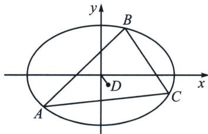
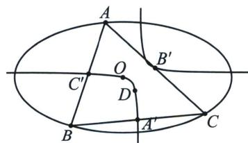

## 三、等轴双曲线反演与二阶曲线外心

$\triangle ABC$ 为椭圆 $C$ 的任意内接三角形, 点 $O$ 为原点, 点 $D$ 为 $\triangle ABC$ 的外心. 记直线 $AB 、 BC 、 CA 、 OD$ 的斜率分别为 $k_{1} 、 k_{2} 、 k_{3} 、 k_{4}$ , 且斜率均存在. 求证: $k_{1} k_{2} k_{3} k_{4} = \frac{b^{2}}{a^{2}}$ .

分别取 AB, BC, CA 的中点为 $C'$ , $A'$ , $B'$ , 易知 D 为 $\triangle A'B'C'$ 的垂心.

注意: 由中位线定理, $B^{\prime} C^{\prime} \parallel B C$ , 又因为 $A^{\prime} D \perp B C$ , 所以 $A^{\prime} D \perp B^{\prime} C^{\prime}$ , 其他两组同理, 再取 $x$ 轴和 $y$ 轴方向的无穷远点 $X$ 和 $Y$ . 则 $A^{\prime} B^{\prime} C^{\prime} D X Y$ 为一个等轴双曲线.

由中位线定理 $B^{\prime}C^{\prime} / / BC$ ，所以 $k_{OA^{\prime}} \cdot k_{B^{\prime}C^{\prime}} = k_{OA^{\prime}} \cdot k_{BC} = e^{2} - 1$ ，其他两组同理。由于直线 $OA^{\prime}$ 与直线 $B^{\prime}C^{\prime}$ ，直线 $OB^{\prime}$ 与直线 $A^{\prime}C^{\prime}$ ，直线 $OC^{\prime}$ 与直线 $A^{\prime}B^{\prime}$ ，都满足斜率的对合方程 $k \cdot k^{\prime} = e^{2} - 1$ 。

则由笛沙格对合定理可知，O 点也在该等轴双曲线上!!!（注意：笛沙格对合定理讲述的是一个圆锥曲线上的四点，例如 M, N, S, T. 它们可以生成三组直线，直线 MN 与直线 ST；直线 MS 与直线 NT；直线 MT 与直线 NS；每组直线被同一条直线 l 所截得到的两个交点，都会满足同一个对合方程的，包括该圆锥曲线被直线 l 所截得到的两个交点，也会满足该对合方程，由于原题是一个关于斜率的命题，那自然而然，要对无穷远直线应用笛沙格对合定理了）现只需对 O, D, A', B' 与无穷远直线应用笛沙格对合定理即：

不妨设对合方程为 $ckk'-a(k+k')-b=0$ ，由于无穷远点 X 和 Y 的斜率分别是 0 和 $\infty$ 。则 a=0。

（注：前面说过了 $0 \cdot \infty$ ，这种未定式是可以等于任意常数的，所以 $kk'$ 是有意义的，但是 $0 + \infty$ 就没意义了，所以 $a = 0$ ）即对合方程为 $ckk' - b = 0$ .

则 $\left\{\begin{aligned}ck_{OD}k_{A'B'}-b=0\\ ck_{OA'}k_{DB'}-b=0\\ ck_{OB'}k_{A'D}-b=0\end{aligned}\right.$ ，即 $\left\{\begin{aligned}ck_{4}k_{1}-b=0\\ c\left(\frac{e^{2}-1}{k_{2}}\right)\cdot\left(-\frac{1}{k_{3}}\right)-b=0\\ c\left(\frac{e^{2}-1}{k_{3}}\right)\cdot\left(-\frac{1}{k_{2}}\right)-b=0\end{aligned}\right.$ ，则 $k_{1}k_{2}k_{3}k_{4}=1-e^{2}=\frac{b^{2}}{a^{2}}.$

同理，双曲线也有相似结论

点 A, B, C 在双曲线 $\Gamma: \frac{x^{2}}{a^{2}} - \frac{y^{2}}{b^{2}} = 1 (a > 0, b > 0)$ 上，设 $\triangle ABC$ 的外接圆的圆心为点 M，若 $\triangle ABC$ 三边斜率存在，则 $k_{AB} k_{BC} k_{CA} k_{OM} = -\frac{b^{2}}{a^{2}}$
