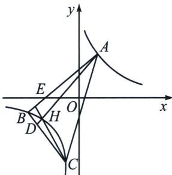

## 二、等轴双曲线轮换对合与隐藏的垂心

定理：等轴双曲线内接三角形垂心在双曲线上

如图， $\triangle ABC$ 的三个顶点均在函数 $y = \frac{m}{x}$ 的图象上，试判断 $\triangle ABC$ 的垂心 $H$ 是否也在 $y = \frac{m}{x}$ 的图象上，并说明理由.

证明：令 $A(x_{1}, y_{1}), B(x_{1}, y_{1}), C(x_{1}, y_{1})$ 在等轴双曲线 $y = \frac{m}{x}$ 上，在双曲线找到点 $I(x_{4}, y_{4})$ ，且满足 $AB \perp IC$ ，则根据反比例的两点对合方程： $\left\{ \begin{array}{l} AB: \frac{x_{1}x_{2}}{m}y + x = x_{1} + x_{2} \\ CI: \frac{x_{3}x_{4}}{m}y + x = x_{3} + x_{4} \end{array} \right.$ ，由于 $AB \perp IC$ ，所以 $\frac{m}{x_{1}x_{2}} \cdot \frac{m}{x_{3}x_{4}} = -1$ ，所以 $k_{AI}k_{BC} = k_{BI}k_{AC} = \frac{m^{2}}{x_{1}x_{2}x_{3}x_{4}} = -1$ ，所以 $I(x_{4}, y_{4})$ 是 $\triangle ABC$ 的垂心，与 $H$ 重合.

![[高中/总复习/专题/2026版高中《mst老唐说题》圆锥曲线专题（数学）/下册/第12章_调和点列与调和线束定理与对合关系/第五节_斜率积的三次对合/二_等轴双曲线轮换对合与隐藏的垂心/例题/Q00053207.md]]
