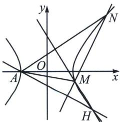

<!-- question-source:start -->
例2 (2023·南京二模)已知双曲线 $C: \frac{x^2}{a^2} - \frac{y^2}{b^2} = 1 (a, b > 0)$ 的离心率为 $\sqrt{2}$ , 直线 $l_1: y = 2x + 4\sqrt{3}$ 与双曲线 $C$ 仅有一个公共点.

(1)求双曲线 $C$ 的方程

(2)设双曲线 C 的左顶点为 A，直线 $l_{2}$ 平行于 $l_{1}$ ，且交双曲线 C 于 M，N 两点，求证： $\triangle AMN$ 的垂心在双曲线 C 上.

(1)因为双曲线 $C$ 的离心率为 $\sqrt{2}$ , 所以 $\frac{a^2 + b^2}{a^2} = 2$ , 即 $a^2 = b^2$ , 所以双曲线 $C$ 的方程为 $x^2 - y^2 = a^2$ ,

联立直线 $l_{1}$ 与双曲线 C 的方程 $\left\{\begin{aligned} y &= 2x + 4\sqrt{3} \\ x^{2} - y^{2} &= a^{2}\end{aligned}\right.$ ，消去 y 得 $x^{2} - (2x + 4\sqrt{3})^{2} = a^{2}$ ，

即 $(\sqrt{3}x)^{2}+16(\sqrt{3}x)+a^{2}+48=0$ ，因为 $l_{1}$ 与双曲线C仅有一个公共点，所以 $\triangle=16^{2}-4(a^{2}+48)=0$ ，

(2)证明: 解法一(直接联立): 设 $l_{2}: y = 2x + m (m \neq 4\sqrt{3})$ , $M(x_{1}, y_{1})$ , $N(x_{2}, y_{2})$ , 则 $M$ 、 $N$ 满足 $\left\{ \begin{array}{l} y = 2x + m, \\ x^{2} - y^{2} = 16, \end{array} \right.$ 消去 $y$ 得 $3x^{2} + 4mx + m^{2} + 16 = 0$ , 所以 $x_{1} + x_{2} = -\frac{4}{3}m$ , $x_{1}x_{2} = \frac{m^{2} + 16}{3}$ , 如图所示, 过 $A$ 引 $MN$ 的垂线交 $C$ 于另一点 $H$ , 则 $AH$ 的方程为 $y = -\frac{1}{2}x - 2$ . 代入 $x^{2} - y^{2} = 16$ 得 $3x^{2} - 8x - 80 = 0$ , 即 $x = -4$ (舍去)或 $x = \frac{20}{3}$ .

所以点 $H$ 为 $\left(\frac{20}{3}, -\frac{16}{3}\right)$ . 所以 $k_{AN} k_{MH} = \frac{y_2(y_1 + \frac{16}{3})}{(x_2 + 4)(x_1 - \frac{20}{3})} = \frac{3(2x_1 + m)(2x_2 + m) + 16(2x_2 + m)}{(3x_1 - 20)(x_2 + 4)}$ $= \frac{12x_1x_2 + 6m(x_1 + x_2) + 32x_2 + 3m^2 + 16m}{3x_1x_2 + 12(x_1 + x_2) - 32x_2 - 80} = \frac{4(m^2 + 16) - 8m^2 + 3m^2 + 16m + 32x_2}{m^2 + 16 - 16m - 32x_2 - 80}$ $= \frac{-m^2 + 16m + 32x_2 + 64}{m^2 - 16m - 32x_2 - 64} = -1$ ，所以 $MH \perp AN$ ，故 $H$ 为 $\triangle AMN$ 的垂心，得证.
<!-- question-source:end -->

![[高中/总复习/专题/2026版高中《mst老唐说题》圆锥曲线专题（数学）/下册/第12章_调和点列与调和线束定理与对合关系/第五节_斜率积的三次对合/二_等轴双曲线轮换对合与隐藏的垂心/例题/answers/Q00048868A1.md]]
