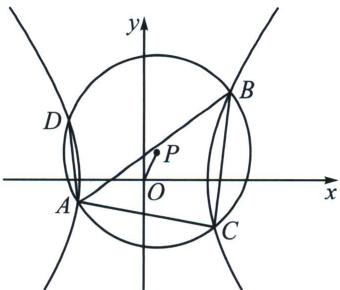

<!-- question-source:start -->
例3 (河北名校联盟25届高三一轮收官考T19)已知双曲线 $\Omega: \frac{x^{2}}{a^{2}} - \frac{y^{2}}{b^{2}} = 1 (a > 0, b > 0)$ 的焦点到渐近线的距离为1，右顶点到点 $P(1, 1)$ 的距离是 $\sqrt{2}$ 。动圆 $P$ （点 $P$ 为圆心）与 $\Omega$ 交于四个不同的点 $A, B, C, D$ ，且直线 $AC, AD$ 的斜率分别为 $k_{1}, k_{2}$ 。

(1)求 $\Omega$ 的方程.

(2)设直线 AB: $y=kx+m$ .

(i) 判断点 $(2k, m)$ 是否在双曲线 $x^{2} - y^{2} = 1$ 上，并说明理由.

(ii) 若 k=4，求直线 AB 的一般式方程.

(iii)试问 $kk_{1}k_{2}$ 是否为定值？若是，求出该定值；若不是，请说明理由.

<!-- question-source:end -->

![[高中/总复习/专题/2026版高中《mst老唐说题》圆锥曲线专题（数学）/下册/第12章_调和点列与调和线束定理与对合关系/第五节_斜率积的三次对合/四_三次方程韦达定理与三次齐次化方程/例题/answers/Q00053208A1.md]]
