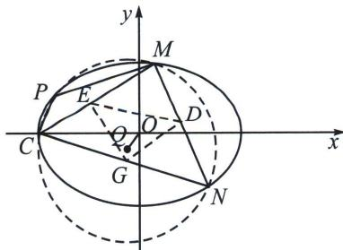

## 四、三次方程韦达定理与三次齐次化方程

设实系数一元三次方程 $ax^3 + bx^2 + cx + d = 0 (a \neq 0)$ ①在复数集 $C$ 内的根为 $x_1, x_2, x_3$ ，可变形为$a(x - x_{1})(x - x_{2})(x - x_{3}) = 0$ ，展开得 $ax^3 - a(x_1 + x_2 + x_3)x^2 + a(x_1x_2 + x_1x_3 + x_2x_3)x - ax_1x_2x_3 = 0.$ ②比较①②可以得到 $\left\{ \begin{array}{l}x_{1} + x_{2} + x_{3} = -\frac{b}{a},\\ x_{1}x_{2} + x_{1}x_{3} + x_{2}x_{3} = \frac{c}{a},\\ x_{1}x_{2}x_{3} = -\frac{d}{a}. \end{array} \right.$ 这就是三次方程的韦达定理.

回到例题1，要证明 $k_{MN}k_{CM}k_{CN}k_{OQ} = \frac{8}{9}$ ，我们给予齐次化解法：利用四点共圆 $k_{CP} + k_{MN} = 0$ ，故只需证 $k_{CP}k_{CM}k_{CN}k_{OQ} = -\frac{8}{9}$ ，我们构造三次的齐次化方程，这就需要二次与一次的对合相乘，由于 $k = \frac{y}{x + 3}$ ，

先对椭圆方程变形： $\frac{x^{2}}{9}+\frac{y^{2}}{8}=1\Leftrightarrow\frac{(x+3)^{2}}{9}+\frac{y^{2}}{8}=\frac{2}{3}(x+3)$ ，

再对圆 $Q(x_0, y_0)$ 方程： $(x - x_0)^2 + (y - y_0)^2 = r^2 \Leftrightarrow (x + 3)^2 + y^2 = 2(x - x_0)(x + 3) + 2yy_0$

所以 $\left[\frac{(x + 3)^2}{9} +\frac{y^2}{8}\right]\left[(x_0 + 3)(x + 3) + yy_0\right] = \left[(x + 3)^2 +y^2\right]\frac{1}{3} (x + 3)$ （交叉相乘），

同除以 $(x + 3)^{3}$ ， $\left(\frac{1}{9} +\frac{k^2}{8}\right)[(3 + x_0) + ky_0] = \frac{1}{3} +\frac{k^2}{3}$ ，即 $\frac{y_0}{8} k^3 +\left(\frac{1}{24} +\frac{x_0}{8}\right)k^2 +\frac{1}{9} y_0k + \frac{x_0}{9} = 0,$

所以 $k_{CP}k_{CM}k_{CN} = -\frac{8x_0}{9y_0}$ ，即 $k_{CP}k_{CM}k_{CN}k_{OQ} = -\frac{8}{9}$ .

本题也可以平移后构造“非齐次化”的叉乘对合方程，操作差不多：

将椭圆和圆按照向量 $\overrightarrow{CO} = (3,0)$ 平移，即 $\frac{(x - 3)^2}{9} +\frac{y^2}{8} = 1$ ，故构造非齐次方程： $\frac{x^2}{9} +\frac{y^2}{8} = \frac{2x}{3}$

设平移后过原点的圆 $Q^{\prime}$ 圆心为 $Q^{\prime}(x_0,y_0)$ ，则 $(x - x_0)^2 +(y - y_0)^2 = r^2\Leftrightarrow x^2 +y^2 = 2xx_0 + 2yy_0$

交叉相乘构造齐次化： $\left(\frac{x^2}{9} +\frac{y^2}{8}\right)(xx_0 + yy_0) = (x^2 +y^2)\frac{x}{3}$ ，同除以 $x^{3}$ 得： $\frac{y_0}{8} k^3 +\left(\frac{x_0}{8} -\frac{1}{3}\right)k^2 +\frac{1}{9} y_0k+$ $\frac{x_0}{9} -\frac{1}{3} = 0$ ， $k_{CP}k_{CM}k_{CN} = -\frac{8(x_0 - 3)}{9y_0}$ ，又 $k_{OQ} = \frac{y_0}{x_0 - 3}$ ，所以 $k_{CP}k_{CM}k_{CN}k_{OQ} = -\frac{8}{9}$

![[高中/总复习/专题/2026版高中《mst老唐说题》圆锥曲线专题（数学）/下册/第12章_调和点列与调和线束定理与对合关系/第五节_斜率积的三次对合/四_三次方程韦达定理与三次齐次化方程/例题/Q00053208.md]]
