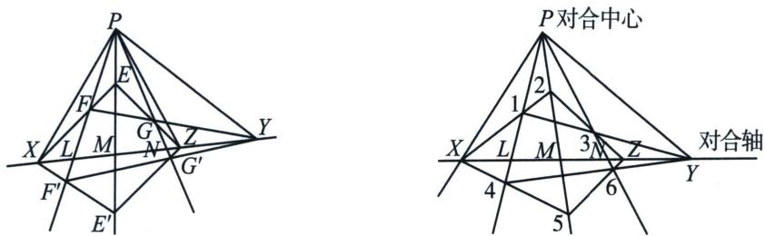

<!-- question-source:start -->
例①（2024·江苏省四校联合）交比是射影几何中最基本的不变量，在欧氏几何中亦有应用。若 $l_{1}, l_{2}, l_{3}, l_{4}$ 为平面上过定点 $P$ 且互异的四条直线， $L_{1}, L_{2}$ 为不过点 $P$ 且互异的两条直线，证明：若 $\triangle EFG$ 与 $\triangle E'F'G'$ 的对应边不平行，对应顶点的连线交于同一点，则 $\triangle EFG$ 与 $\triangle E'F'G'$ 对应边的交点在一条直线上。

<!-- question-source:end -->

![[高中/总复习/专题/2026版高中《mst老唐说题》圆锥曲线专题（数学）/下册/第12章_调和点列与调和线束定理与对合关系/第六节_从笛沙格定理到帕斯卡定理/一_笛沙格对合/例题/answers/Q00053209A1.md]]
