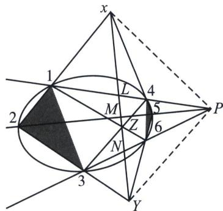

> [!faq]- 《圆锥曲线专题(下册)》例题解析
>
> > [!success]- **【答案】** 详见解析
>
> > [!note]- **【解析】**
> > 解析 如左图，设 $EF$ 与 $E'F'$ 交于 $X$ ， $FG$ 与 $F'G'$ 交于 $Y$ ， $EG$ 与 $E'G'$ 交于 $Z$ ，连接 $XY$ ， $FF'$ 与 $XY$ 交
> >
> > 32 老唐说题
> >
> > 于 $L$ , $EE'$ 与 $XY$ 交于 $M$ , $GG'$ 与 $XY$ 交于 $N$ , 欲证 $X$ , $Y$ , $Z$ 三点共线, 只需证 $Z$ 在直线 $XY$ 上,
> >
> > 考虑线束 XP, XE, XM, $XE'$ ，由第(2)问知(P, F; L, $F'$ )=(P, E; M, $E'$ ),
> >
> > 再考虑线束 $YP$ ， $YF$ ， $YL$ ， $YF'$ ，由第(2)问知 $(P, F; L, F') = (P, G; N, G')$
> >
> > 从而得到 $(P, E; M, E')=(P, G; N, G')$ ,
> >
> > 于是由第(2)问的逆命题知，EG，MN， $E^{\prime}G^{\prime}$ 交于一点，即为点Z，
> >
> > 从而 MN 过点 Z，故 Z 在直线 XY 上，X，Y，Z 三点共线.
> >
> > 如右图, 本题阐述的就是以 $P$ 为对合轴, 确定对合中心的过程, 也是笛沙格定理中最重要的对合理论,在确定对合轴的过程中, 需要构造一个三角形与另一个对应的三角形, 看它们的交叉连线交点确定对合轴.
> >
> > 1640 年，当帕斯卡还只有十六岁时，出了一张题为“圆锥曲线短评”（“Essaypourlesconique”）的小招贴或海报，其中第一次公布了他的著名定理，现把他的定理的原始形式陈述如下：
> >
> > “在 MSQ 三点决定的平面上，通过 M 作直线 MK 和 MV，通过 S 作两条直线 SK 和 SV，并设 K 是 MK 和 SK 的交点，V 是 MV 和 SV 的交点，A 是 MA 和 SA 的交点（A 是 SV 和 MK 的交点）， $\mu$ 是 MV 和 SK 的交点；如果通过 A，K， $\mu$ ，V 四点中的两点，它们不在与 M 和 S 同一条直线上，例如 K 和 V，我们通过一个圆的圆周切割直线 MV，MP，SV，SK 于四点 O，P，Q，N；那么 MS，NO，PQ 三条直线为同阶直线（lines of the same order）”
> >
> > 这里的“同阶直线”Pascal 是指相交于同一点的直线或者是相互平行的直线。把这样画出的图形投影到另一个平面，他就能把定理陈述中的圆替换为任意二阶曲线了。
> >
> > 注意 以上一段仅仅是帕斯卡证明帕斯卡定理时的一个引理，而非整个定理。帕斯卡证明帕斯卡定理时使用了三个引理，再用引理来证明整个定理。
> >
> > 我们只能理解，帕斯卡的“短评”应是一部有关二阶曲线的巨著的一个概述。但是，或许是因帕斯卡的年轻早逝，或许是因当时出版科学著作的困难，也或许是因为他后来对宗教事务的病态似的兴趣，这一部巨著后来始终未曾出来。莱布尼茨曾审查过他的完整著作的一份拷贝，并报道，神秘的六角形著名定理是他的整个理论的基础，且帕斯卡已从它导出了大约四百个推论。这表明这里确实有一位天才能把射影几何中相互没有联系的许多材料塑造成为我们今天看到的如此对称的一座大厦。
> >
> > 
> >
> > 在确定对合轴(帕斯卡线)和对合中心(P 点)，我们发现 1 和 4 关于对合轴对应，2 和 5 以及 3 和 6 都关于对合轴相互对应，对合中心其实就是以对合轴为极线关于椭圆的极点.
> >
> > $X(P, L; 4, 1) = X(P, M; 5, 2)$ ，所以 $(P, L; 4, 1) = (P, N; 6, 3)$ 故XYZ三点共线（帕斯 $Y(P, N; 6, 3) = Y(P, M; 5, 2)$ $Z(P, L; 4, 1) = Z(P, N; 6, 3)$
> >
> > 卡线).
> >
> > 大家发现以 P 为对合中心来确定帕斯卡线比较好理解，但是以此帕斯卡线所构成的椭圆内接六点形非常多，三条直线未必相交于一点 P，那么如何证明帕斯卡定理呢？
