## 二、帕斯卡(Pascal)定理及其逆定理

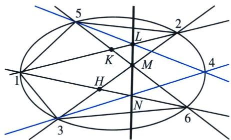  
图 1 L, M, N 三点共线

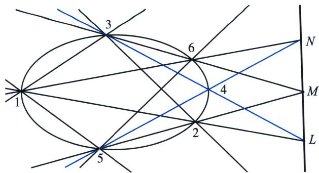  
图 2 L, M, N 三点共线

已知 1, 2, 3, 4, 5, 6 是二阶点列上任意六个点，我们记：

12 与 45 的交点为 $L$ ,

23 与 56 的交点为 M,

34 与 61 的交点为 N，

那么 $L 、 M$ 和 $N$ 三点共线 (此直线叫Pascal线).

证明: 考察图1. 我们把二阶点列看成以点3和5作为顶点的两个线束的对应射线交点的轨迹。因此, 以3为中心连接到1, 2, 4, 6四点的线束与以5为中心连接到1, 2, 4, 6四点的线束为射影对应。但线束3(1, 2, 4, 6)在连线1-6上截出四点1, H, N, 6, 故1, 2, 4, 6与1, H, N, 6为透视对应; 同样, 线束5(1, 2, 4, 6)在连线1-2上截出四点1, K, L, 2, 故1, 2, 4, 6与1, K, L, 2也透视对应。由此, 根据射影对应的传递性, 可知点列1, H, N, 6与点列1, K, L, 2为射影对应。但这两个射影对应点列的交点1是一个自对应点, 故它们的射影对应为透视对应, 必有一个共同的透视中心。这个透视中心可由任意2组对应点的连线求交得到。现取两个连线分别为6-K和2-H, 故可求出交点M。这样, 两个点列的对应点L和N的连线也通过中心M。这样证明了L, M, N三点共线。对图2可类似证明, 但辅助点的作法与图1不同。

$L, M, N$ 三个点中，也允许有无穷远点．例如，图3中若有一对边平行，如23与56平行，则它们的交点 $M$ 是与23和56有共同方向的无穷远点.

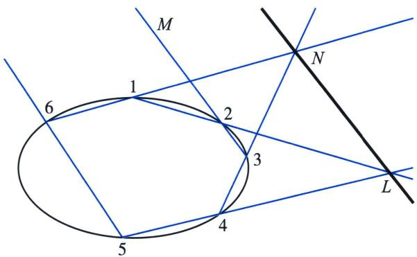  
图 3 帕斯卡定理中允许有无穷远交点

究竟有多少种不同的情况呢？对于6点位置，共有 $6! = 720$ 种排列，但轮换相同的6种排列（如123456, 234561, …, 612345）构成的回路相同，顺时针和逆时针排，如123456和564321，也代表相同回路，不同排列的回路（即Hamilton回路）情况为 $(6-1)! / 2 = 60$ 种。帕斯卡定理说明对于这60种不同的回路都会使它们的6顶点的三组对边的交点L、M、N共线。

最后还要说明两点: 六个顶点中, 如相邻两个顶点有 1 到 3 个重合, 这样六个点就变成 5 个、4 个或 3 个, 这时帕斯卡定理仍然成立.

## 1. 寻找帕斯卡第六点

帕斯卡定理为通过五点作圆锥曲线提供了一种优美的解决方案。设已给1，2，3，4，5五点，其中任意三点不在同一直线上，但五点的平面位置为任意。我们将这五点依次相连，并设线段12与45的交点为 $L$ ，如图4-1所示。

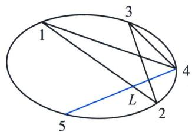  
图4-1

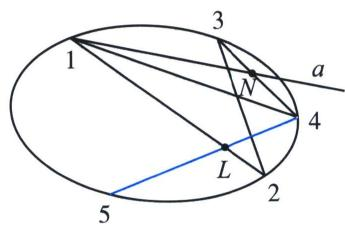  
图4-2

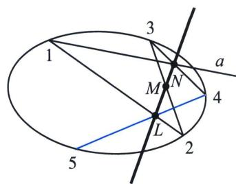  
图4-3

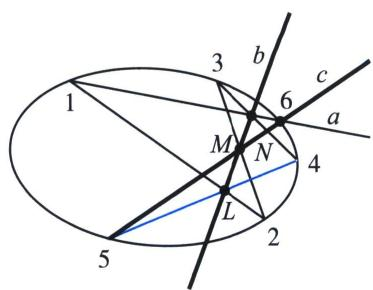  
图4-4

为了作圆锥曲线上的任意一点，如点6，我们通过点1任意作一直线a，设a与线段34交于点N，见图4-2；再通过L和N作直线b，设b与a交于M，图4-3；再通过5和M作直线c，则c与a的交点就是期望的点6，见图4-4．利用这种办法，让a绕1旋转一圈，就可以得到二阶曲线所有点．这种作图方法的核心就是L，N，M三点在一直线上.

## 2. 圆锥线的切线

如果帕斯卡定理的六点 123456 中有两点不巧重合，则它们两点变一点，而两点之间的连线变成它们共同点的切线。据此，可用帕斯卡定理为已知五点寻找其中一点的切线。

设已知平面上五点 12345，我们来作通过五点的圆锥曲线且在 1 有切线.

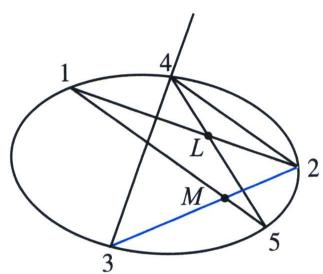  
图5-1

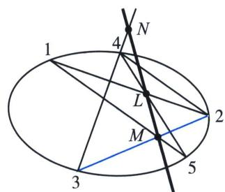  
图5-2

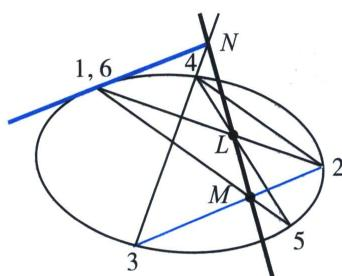  
图5-3

首先，把12345五点中五个对边12，23，34，45，51依次连接起来，使它们成一个五边形（这里是一五角星），并设12和45交点为 $L$ ，15和23交点为 $M$ ，如图5-1所示．再把LM连起来，设与34交点为 $N$ 如图5-2所示，

最后，把1点看成1与6两点的重合点，则16作为34的一个对边，根据帕斯卡定理应和其余两组对边12-45，15-23的交点 $L$ 和 $M$ 共线，所以，我们连接 $N$ 和1，它就是16的连线，亦即轨迹在1处的切线，如图5-3所示.

## 高中数学 新思路 圆锥专题

## 3. 帕斯卡圆锥曲线的内接四点形

两对顶点可组成一四边形．帕斯卡定理为这种特殊情况给出了一个非常重要的定理：圆锥曲线的内接四边形的两组对边的交点与两组对顶点的切线的交点在同一直线上.

如图 6, ABCD 是圆锥曲线的任意一个内接四边形. 对边 AB 与 CD 交于 L, AD 与 BC 交于 M, 对顶点 A 与 C 的切线交于 N, B 与 D 的切线交于 P, 我们要证明 L, M, N, P 四点在同一条直线上.

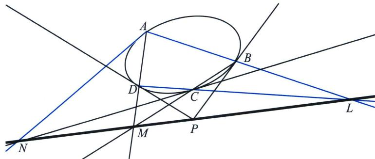

图 6 ABCD 两组对边交点 M, L 与两对顶点切线交点 N, P 共线  
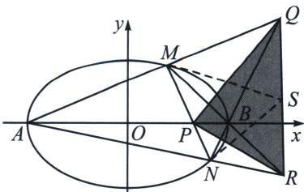  
图 7 自极三角形 PQR，极线是帕斯卡线，且 QS=RS

在使用帕斯卡定理解读高考题时，一定要做好汉密尔顿回路的字母排序，如果出现切线，那就将两点重复表示，具体操作我们可以参考例题.

![[高中/总复习/专题/2026版高中《mst老唐说题》圆锥曲线专题（数学）/下册/第12章_调和点列与调和线束定理与对合关系/第六节_从笛沙格定理到帕斯卡定理/二_帕斯卡_Pascal_定理及其逆定理/例题/Q00048870.md]]
![[高中/总复习/专题/2026版高中《mst老唐说题》圆锥曲线专题（数学）/下册/第12章_调和点列与调和线束定理与对合关系/第六节_从笛沙格定理到帕斯卡定理/二_帕斯卡_Pascal_定理及其逆定理/例题/Q00048871.md]]
![[高中/总复习/专题/2026版高中《mst老唐说题》圆锥曲线专题（数学）/下册/第12章_调和点列与调和线束定理与对合关系/第六节_从笛沙格定理到帕斯卡定理/二_帕斯卡_Pascal_定理及其逆定理/例题/Q00048872.md]]
![[高中/总复习/专题/2026版高中《mst老唐说题》圆锥曲线专题（数学）/下册/第12章_调和点列与调和线束定理与对合关系/第六节_从笛沙格定理到帕斯卡定理/二_帕斯卡_Pascal_定理及其逆定理/例题/Q00048873.md]]
![[高中/总复习/专题/2026版高中《mst老唐说题》圆锥曲线专题（数学）/下册/第12章_调和点列与调和线束定理与对合关系/第六节_从笛沙格定理到帕斯卡定理/二_帕斯卡_Pascal_定理及其逆定理/例题/Q00048874.md]]
![[高中/总复习/专题/2026版高中《mst老唐说题》圆锥曲线专题（数学）/下册/第12章_调和点列与调和线束定理与对合关系/第六节_从笛沙格定理到帕斯卡定理/二_帕斯卡_Pascal_定理及其逆定理/例题/Q00048875.md]]
