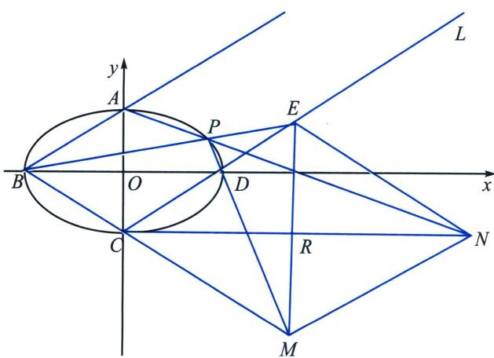
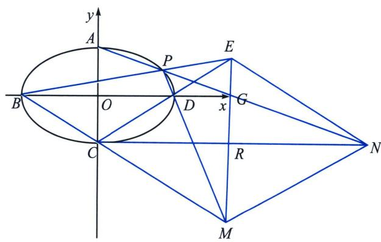

<!-- question-source:start -->
例1 (2023·北京)已知椭圆 $E: \frac{x^2}{a^2} + \frac{y^2}{b^2} = 1 (a > b > 0)$ 的离心率为 $\frac{\sqrt{5}}{3}$ , $A$ 、 $C$ 分别为 $E$ 的上、下顶点, $B$ 、 $D$ 分别为 $E$ 的左、右顶点, $|AC| = 4$ .

(1)求 $E$ 的方程;

(2) 点 $P$ 为第一象限内 $E$ 上的一个动点, 直线 $PD$ 与直线 $BC$ 交于点 $M$ , 直线 $PA$ 与直线 $y = -2$ 交于点 $N$ . 求证: $MN \parallel CD$ .

(1)由题意可得: $2b = 4$ , $e = \frac{\sqrt{5}}{3} = \frac{c}{a}$ , $a^2 = b^2 + c^2$ , 解得 $b = 2$ , $a^2 = 9$ , 所以椭圆 $E$ 的方程为 $\frac{x^2}{9} + \frac{y^2}{4} = 1$ .

(2)极点极线背景分析：延长 $BP$ 和 $CD$ 交于 $E$ ，连接 $EM$ 交 $CN$ 于 $R$ ，

方案一(帕斯卡定理): 由于过 $C$ 作椭圆的切线, 所以我们记为六边形 $BCCDPA$ , $BC$ 与 $DP$ 交点 $M$ , $CC$ 与 $PA$ 交点 $N$ , $CD$ 与 $AB$ 交点记为 $L$ , 由于 $CD \parallel AB$ , 故 $L$ 在无穷远处, 故 $MN \parallel AB \parallel CD$ .

方案二(交比不变性)以 C 为射影中心，由于 $\left|BO\right|=\left|OD\right|$ ，故 $C(B,D;O,\infty)=-1$ ，根据交比不变性 $C(B,D;O,\infty)=C(M,E;\infty,R)=-1$ ，故 $\left|ER\right|=\left|MR\right|$ ，故 $CR\perp EM$ ，我们仅需证 CMNE 为菱形，由于 $\left|AO\right|=\left|OC\right|$ ， $BD\parallel CN$ ，令 BD 与 EM 交于 G，则 G 为 AN 中点，则 $\left|CR\right|=\left|RN\right|$ ，故 CMNE 为菱形.
<!-- question-source:end -->

![[高中/总复习/专题/2026版高中《mst老唐说题》圆锥曲线专题（数学）/下册/第12章_调和点列与调和线束定理与对合关系/第六节_从笛沙格定理到帕斯卡定理/二_帕斯卡_Pascal_定理及其逆定理/例题/answers/Q00048870A1.md]]
