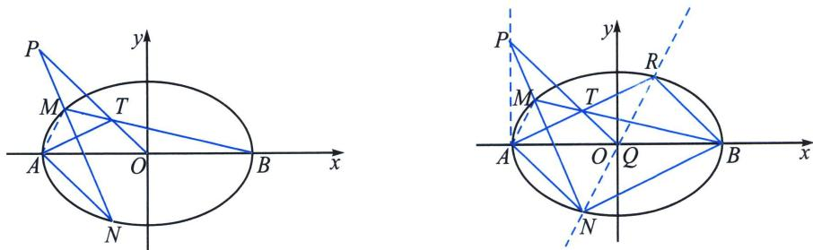
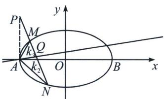
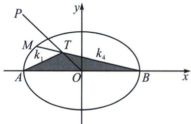

<!-- question-source:start -->
例2 (2023·西城区模拟)已知点 $A, B$ 是椭圆 $E: \frac{x^2}{a^2} + \frac{y^2}{b^2} = 1 (a > b > 0)$ 的左, 右顶点, 椭圆 $E$ 的短轴长为 2 , 离心率为 $\frac{\sqrt{3}}{2}$ .

(1)求椭圆 E 的方程;

(2) 点 O 是坐标原点，直线 l 经过点 $P(-2, 2)$ ，并且与椭圆 E 交于点 M，N，直线 BM 与直线 OP 交于点 T，设直线 AT，AN 的斜率分别为 $k_{1}$ ， $k_{2}$ ，求证： $k_{1}k_{2}$ 为定值.

(1)由题意可得 $2b = 2$ ， $e = \frac{c}{a} = \sqrt{1 - \frac{b^2}{a^2}} = \frac{\sqrt{3}}{2}$ ，可得 $a = 2$ ， $b = 1$ ，所以椭圆的方程为： $\frac{x^2}{4} +y^2 = 1$

(2)极点极线背景分析: 延长 $AT$ 交椭圆于 $R$ , 在椭圆内接六边形 $AABMNR$ (汉密尔顿回路) 中, $AA$ 与 $MN$ 交于 $P$ , $AB$ 与 $NR$ 交于点 $Q$ , $BM$ 与 $RA$ 交于点 $T$ , 根据帕斯卡定理, 则 $P$ , $T$ , $Q$ 三点共线, 由于 $Q$ 在 $x$ 轴上, 故 $O$ 与 $Q$ 重合, 根据第三定义, 有 $k_{1} k_{2} = k_{RA} k_{RB} = - \frac{1}{4}$ .

本题具体解答过程在于翻译帕斯卡线上的三点，也是曲线上六点(包含二重点 A)，以及不在曲线上的三点，解法一：首先分析点 $P(2, 2)$ ，以 P 为极点的极线方程为 $\frac{x}{2} + 2y = 1$ ，即为直线 AQ，如下左图，则

$A(P, Q; M, N) = -1$ , AP、AQ、AM、AN 为调和线束，由于 $k_{AP} = \infty$ ，则 $k_{2} + k_{3} = 2k_{AQ} = \frac{1}{2}$ ，利用齐次化证明 $k_{2} + k_{3} = \frac{1}{2}$ ，

将椭圆按照向量 $\overrightarrow{AO}=(2,0)$ 平移， $\frac{(x-2)^{2}}{4}+y^{2}=1$ ，即 $\frac{x^{2}}{4}+y^{2}-x=0$ ，此时 $A\to O,\ P\to P^{\prime}(0,2)$ ， $M\to M^{\prime},N\to N^{\prime}$ ，此时 $M^{\prime}N^{\prime}:mx+\frac{y}{2}=1$ ，联立得： $\frac{x^{2}}{4}+y^{2}-x\left(mx+\frac{y}{2}\right)=0$ ，（齐次化同除以 $x^{2}$ )即 $\left(\frac{y}{x}\right)^{2}-\frac{1}{2}\frac{y}{x}+\left(\frac{1}{4}-m\right)=0$ ，所以 $k_{AM}+k_{AN}=k_{2}+k_{3}=\frac{1}{2}$ ；

再分析点 O，一个圆锥曲线对称中心，就是给到第三定义， $k_{AM}=k_{3}=\frac{y_{M}}{x_{M}+2}$ ， $k_{BM}=k_{4}=\frac{y_{M}}{x_{M}-2}$ ， $k_{3}k_{4}=-\frac{1}{4}$ ；分析点 T，就要结合底边在 x 轴上得中点三角形 ATB，如右图，则 $\frac{1}{k_{1}}+\frac{1}{k_{4}}=\frac{2}{k_{OT}}=-2$ ，所以 $k_{1}=-\frac{k_{4}}{2k_{4}+1}$ ；综上， $k_{1}k_{2}=-\frac{k_{4}}{2k_{4}+1}\left(\frac{1}{2}-k_{3}\right)=-\frac{\frac{1}{2}k_{4}+\frac{1}{4}}{2k_{4}+1}=-\frac{1}{4}$ .
<!-- question-source:end -->

![[高中/总复习/专题/2026版高中《mst老唐说题》圆锥曲线专题（数学）/下册/第12章_调和点列与调和线束定理与对合关系/第六节_从笛沙格定理到帕斯卡定理/二_帕斯卡_Pascal_定理及其逆定理/例题/answers/Q00048871A1.md]]
