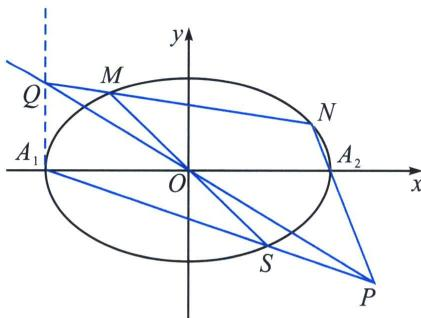

<!-- question-source:start -->
例3 (2024·成都模拟)已知 $A_{1}(-3, 0)$ 和 $A_{2}(3, 0)$ 是椭圆 $\eta: \frac{x^{2}}{a^{2}} + \frac{y^{2}}{b^{2}} = 1 (a > b > 0)$ 的左、右顶点，直线 $l$ 与椭圆 $\eta$ 相交于 $M, N$ 两点，直线 $l$ 不经过坐标原点 $O$ ，且不与坐标轴平行，直线 $A_{1}M$ 与直线 $A_{2}M$ 的斜率之积为 $-\frac{5}{9}$ .

(1)求椭圆 $\eta$ 的标准方程;

(2)若直线 $OM$ 与椭圆 $\eta$ 的另外一个交点为 $S$ , 直线 $A_{1} S$ 与直线 $A_{2} N$ 相交于点 $P$ , 直线 $PO$ 与直线 $l$ 相交于点 $Q$ , 证明: 点 $Q$ 在一条定直线上, 并求出该定直线的方程.

(1)不妨设 $M(x_{1}, y_{1})$ ， $N(x_{2}, y_{2})$ ，易知 $k_{A_{1}M} \cdot k_{A_{2}M} = \frac{y_{1}}{x_{1} + 3} \cdot \frac{y_{1}}{x_{1} - 3} = -\frac{5}{9}$ ，又 $a = 3$ ，所以 $\frac{x_{1}^{2}}{9} + \frac{y_{1}^{2}}{b^{2}} = 1$ ，整理得 $y_{1}^{2} = b^{2}\left(1 - \frac{x_{1}^{2}}{9}\right)$ ，又 $y_{1}^{2} = -\frac{5}{9}(x_{1}^{2} - 9)$ ，所以 $b^{2} = 5$ ，则椭圆 $\eta$ 的标准方程为 $\frac{x^{2}}{9} + \frac{y^{2}}{5} = 1$ ；

(2)极点极线背景分析：

方案一(构造回路后同一法): 构造椭圆内接六边形 $A_{1}A_{1}A_{2}NMS$ (汉密尔顿回路), $A_{1}A_{1}$ 与 $MN$ 交于 $Q'$ , $A_{1}A_{2}$ 与 $MS$ 交于 $O$ , $A_{2}N$ 与 $A_{1}S$ 交于 $P$ , 根据帕斯卡定理, 则 $P$ , $O$ , $Q'$ 三点共线, 由于 $Q'$ 在 $OP$ 上, 故 $Q'$ 与 $Q$ 重合. 点 $Q$ 在定直线 $x = -3$ 上.

方案二(探索回路锁定退化五点): 本题也是汉密尔顿回路的五边形探索第六点, $A_{1}A_{2}$ 与 $MS$ 交于 $O$ , 排序 12 与 45, $A_{2}N$ 与 $A_{1}S$ 交于 $P$ , 排序 23 与 51, 则出现了 $A_{1}A_{2}NMS$ 这五点的排序, 由于点 $P$ 没有出现 23 与 56 的交点, 而是 23 与 51, 说明 16 两点是二重点 (切点), 由于 $Q$ 在帕斯卡线上, 故 $Q$ 为 $NM$ 与 $A_{1}A_{1}$ 交点, 此时汉密尔顿回路为 $A_{1}A_{2}NMSA_{1}$ , 故 $Q$ 在定直线 $x = -3$ 上.
<!-- question-source:end -->

![[高中/总复习/专题/2026版高中《mst老唐说题》圆锥曲线专题（数学）/下册/第12章_调和点列与调和线束定理与对合关系/第六节_从笛沙格定理到帕斯卡定理/二_帕斯卡_Pascal_定理及其逆定理/例题/answers/Q00048872A1.md]]
