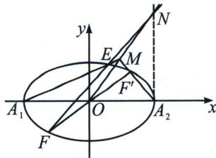
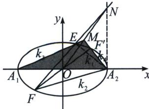

<!-- question-source:start -->
例4 (2024·北京信息卷)已知椭圆 $C: \frac{x^2}{a^2} + \frac{y^2}{b^2} = 1 (a > b > 0)$ 的离心率 $e = \frac{2\sqrt{2}}{3}$ , 且过点 $P(\sqrt{6}, \frac{\sqrt{3}}{3})$ .

(1)求椭圆 C 的方程;

(2)设 $A_{1}$ , $A_{2}$ 为椭圆 $C$ 的左. 右顶点, 不过原点的直线 $l$ 与椭圆 $C$ 交于 $E$ , $F$ 两点, 点 $F$ 关于原点 $O$ 的

对称点为 $F'$ , 直线 $A_{1} E$ 与直线 $A_{2} F'$ 交于点 $M$ , 求证: 直线 $O M$ 与直线 $E F$ 的交点 $N$ 在定直线上.

## 解析
(1) $\frac{x^{2}}{9}+y^{2}=1$

(2)极点极线背景分析(探索回路锁定退化五点):

如上左图， $A_{2}A_{1}$ 与 $FF'$ 交于 $O$ ，排序 12 与 45， $A_{1}E$ 与 $F'A_{2}$ 交于 $M$ ，排序 23 与 51，则出现了 $A_{2}A_{1}EFF'$ 这五点的排序，由于点 $N$ 没有出现在 23 与 56 的交点，而是 23 与 51 交点，说明 16 两点是二重点（切点），由于 $N$ 在帕斯卡线上，故 $N$ 为 $EF$ 与 $A_{2}A_{2}$ 交点，此时汉密尔顿回路为 $A_{2}A_{1}EFF'A_{2}$ ，故 $N$ 在定直线 $x=3$ 上.
<!-- question-source:end -->

![[高中/总复习/专题/2026版高中《mst老唐说题》圆锥曲线专题（数学）/下册/第12章_调和点列与调和线束定理与对合关系/第六节_从笛沙格定理到帕斯卡定理/二_帕斯卡_Pascal_定理及其逆定理/例题/answers/Q00048873A1.md]]
