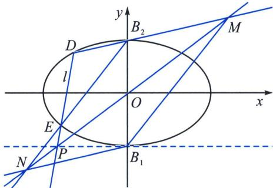
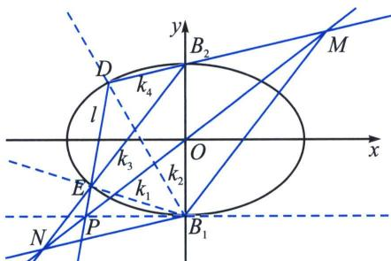

<!-- question-source:start -->
例6（2024·沈阳模拟）已知如图，点 $B_{1}$ ， $B_{2}$ 为椭圆 $C$ 的短轴的两个端点，且 $B_{2}$ 的坐标为 $(0, 1)$ ，椭圆 $C$ 的离心率为 $\frac{\sqrt{2}}{2}$ .

(1)求椭圆 C 的标准方程;

(2)若直线 l 不经过椭圆 C 的中心，且分别交椭圆 C 与直线 y = -1 于不同的三点 D, E, P (点 E 在线段 DP 上)，直线 PO 分别交直线 $DB_{2}$ ， $EB_{2}$ 于点 M, N. 求证：四边形 $B_{1}MB_{2}N$ 为平行四边形.

(1)因为 $B_{2}$ 的坐标为 $(0, 1)$ ，椭圆 $C$ 的离心率为 $\frac{\sqrt{2}}{2}$ ，所以 $\left\{ \begin{array}{l} b = 1 \\ \frac{c}{a} = \frac{\sqrt{3}}{2} \\ a^2 = b^2 + c^2 \end{array} \right.$ ，

(2)解法一(两点对合式): $DE: \frac{x}{\sqrt{2}} (1 - t_1 t_2) + y(t_1 + t_2) = 1 + t_1 t_2$ ，假设 $DE$ 过 $P(-k, -1)$ ， $OP: y = kx$ ，即 $\left(\frac{k}{\sqrt{2}} - 1\right)t_1 t_2 - (t_1 + t_2) - 1 - \frac{k}{\sqrt{2}} = 0$ ， $k_{DB_2} = -\frac{1 - t_1}{\sqrt{2}(1 + t_1)}$ ， $k_{EB_2} = -\frac{1 - t_2}{\sqrt{2}(1 + t_2)}$ $M: \begin{cases} y = kx \\ y = -\frac{1 - t_1}{\sqrt{2}(1 + t_1)} x + 1 \end{cases}$ ，所以 $M\left[\frac{\sqrt{2}(1 + t_1)}{(\sqrt{2}k - 1)t_1 + \sqrt{2}k + 1}, \frac{\sqrt{2}k(1 + t_1)}{(\sqrt{2}k - 1)t_1 + \sqrt{2}k + 1}\right]$ ，
同理 $N\left[\frac{\sqrt{2}(1 + t_2)}{(\sqrt{2}k - 1)t_2 + \sqrt{2}k + 1}, \frac{\sqrt{2}k(1 + t_2)}{(\sqrt{2}k - 1)t_2 + \sqrt{2}k + 1}\right]$ ， $x_M + x_N = 0$ ，则点 $O$ 为线段 $MN$ 中点，因为 $O$ 为 $B_1 B_1$ 中点，所以四边形 $B_1 MB_2 N$ 为平行四边形.

<!-- question-source:end -->

![[高中/总复习/专题/2026版高中《mst老唐说题》圆锥曲线专题（数学）/下册/第12章_调和点列与调和线束定理与对合关系/第六节_从笛沙格定理到帕斯卡定理/二_帕斯卡_Pascal_定理及其逆定理/例题/answers/Q00048875A1.md]]
