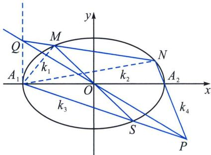
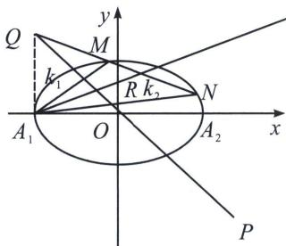

> [!faq]- 《圆锥曲线专题(下册)》例题解析
>
> > [!success]- **【答案】** 详见解析
>
> > [!note]- **【分析】**
> > 本题未单列分析。
>
> > [!note]- **【解析】**
> > 解析
> > 解答书写策略：翻译帕斯卡线上三点，
> > 如下左图，设 $k_{A_1M} = k_1$ ， $k_{A_1N} = k_2$ ， $k_{A_1P} = k_3$ ， $k_{A_2P} = k_4$ ，先翻译 $O$ 点：根据第三定义 $k_1k_3 = -\frac{5}{9}$ ， $k_2k_4 = -\frac{5}{9}$ 再翻译 $P$ 点，根据底边在 $x$ 轴的中线三角形可得： $\frac{1}{k_3} +\frac{1}{k_4} = \frac{2}{k_{PQ}}$ ，所以 $k_{1} + k_{2} = -\frac{5}{9}\left(\frac{1}{k_{3}} +\frac{1}{k_{4}}\right) = -\frac{10}{9k_{PQ}}$ 最后翻译点 $Q$ 所在的位置，由于 $k_{1} + k_{2} = -\frac{10}{9k_{PQ}}$ ，则以 $Q$ 为极点对应的极线为 $A_{1}R$ ，如下右图，必须要出现一个 $k_{A_1Q} = \infty$ ，才会有 $k_{1} + k_{2} = -\frac{10}{9k_{PQ}} = 2k_{A_1R}$ ，此时我们可以用齐次化证明得到最后结果，
> > 
> > 
> > 将椭圆 C 按照向量 $\overrightarrow{A_{1}O}=(3,0)$ 平移， $\frac{(x-3)^{2}}{9}+\frac{y^{2}}{5}=1$ ，即 $\frac{x^{2}}{9}+\frac{y^{2}}{5}-\frac{2}{3}x=0$ ，令 $M^{\prime}N^{\prime}:mx+ny=1$ ，联立得： $\frac{x^{2}}{9}+\frac{y^{2}}{5}-\frac{2}{3}x(mx+ny)=0$ ，同除以 $x^{2}$ 得： $\frac{1}{5}\left(\frac{y}{x}\right)^{2}-\frac{2n}{3}\cdot\frac{y}{x}+\frac{1}{9}-\frac{2}{3}m=0$ ，此时 $k_{1}+k_{2}=\frac{10n}{3}=-\frac{10}{9k_{PQ}}$ ，所以 $n=-\frac{1}{3k_{PQ}}$ ，所以 $M^{\prime}N^{\prime}$ 过定点 $Q^{\prime}(0,-3k_{PQ})$ ，所以 Q 过点 $(-3,-3k_{PQ})$ 。故点 Q 在一条定直线上，该定直线的方程为 x=-3。
