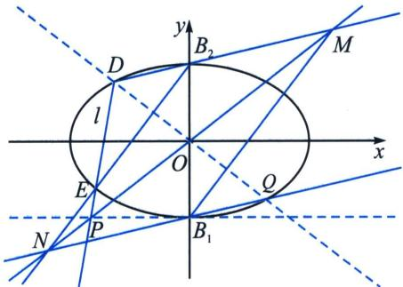
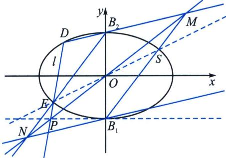

> [!faq]- 《圆锥曲线专题(下册)》例题解析
>
> > [!success]- **【答案】** 详见解析
>
> > [!note]- **【分析】**
> > 本题未单列分析。
>
> > [!note]- **【解析】**
> > 解析
> > 解得 $a^{2}=2,\ b^{2}=1$ ，则椭圆 C 的方程为 $\frac{x^{2}}{2}+y^{2}=1$ ;
> > 解法二(齐次化): 设 $P\left(\frac{1}{m}, -1\right)$ , 根据隐藏斜率关系可探得 $\frac{1}{k_{B_1D}} + \frac{1}{k_{B_1E}} = \frac{1}{k_1} + \frac{1}{k_2} =$ 定值,
> > 将椭圆按照向量 $\overrightarrow{B_1O} = (0, 1)$ 平移， $\frac{x^2}{2} + (y - 1)^2 = 1$ ， $\frac{x^2}{2} + y^2 - 2y = 0$ ，此时 $D'E'$ ： $mx + ny = 1$ ，联立得： $\frac{x^2}{2} + y^2 - 2y (mx + ny) = 0$ ，同除以 $x^2$ 得： $(1 - 2n)\left(\frac{y}{x}\right)^2 - 2m \frac{y}{x} + \frac{1}{2} = 0$ ，此时 $\frac{1}{k_1} + \frac{1}{k_2} = 4m =$ 定值，
> > 根据第三定义， $k_{B_2D} + k_{B_2E} = k_4 + k_3 = -\frac{1}{2}\left(\frac{1}{k_1} +\frac{1}{k_2}\right) = -2m =$ 定值，利用中点斜率模型可知 $k_{NB_1} + k_{NB_2} =$
> > $2k_{NO} = 2k_{OP} = -2m$ ，所以 $k_{B_2D} = k_{NB_1}$ ，同理可证 $k_{B_2E} = k_{MB_1}$ ，所以四边形 $B_{1}MB_{2}N$ 为平行四边形.
> > 极点极线原理分析：如左图延长 $B_{1}N$ 交椭圆于 $Q$ ，我们需要证 $D$ 、 $Q$ 关于原点对称，构造内接六边形 $B_{1}B_{1}B_{2}EDQ$ ， $B_{1}B_{1}$ 与 $ED$ 交于 $P$ ， $B_{1}B_{2}$ 与 $DQ$ 交于 $O'$ ， $B_{2}E$ 与 $B_{1}Q$ 交于 $N$ ，根据帕斯卡定理，则 $P$ ， $N$ ， $O'$ 三点共线，由于 $O'$ 在 $B_{1}B_{2}$ 上，故 $O'$ 与 $O$ 重合。故 $D$ 、 $Q$ 关于原点对称，所以 $B_{1}N//B_{2}M$ .
> > 
> > 
> > 如右图，设 $B_{1}M$ 交椭圆于 $S$ ，我们需要证 $E$ 、 $S$ 关于原点对称，构造内接六边形 $B_{1}B_{1}B_{2}DES$
> > $B_{1}B_{1}$ 与 DE 交于 P， $B_{1}B_{2}$ 与 ES 交于 $O'$ ， $B_{2}D$ 与 $B_{1}S$ 交于 M，根据帕斯卡定理，则 P，M， $O'$ 三点共线，由于 $O'$ 在 $B_{1}B_{2}$ 上，故 $O'$ 与 O 重合。故 E、S 关于原点对称，所以 $B_{1}M \parallel B_{2}N$ 。
> > 所以四边形 $B_{1}MB_{2}N$ 为平行四边形.
