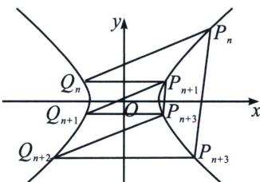

> [!faq]- 《圆锥曲线专题(下册)》例题解析
>
> > [!success]- **【答案】** 详见解析
>
> > [!note]- **【分析】**
> > 要证 $S_{n} = S_{n + 1}$ ，只需先尝试 $P_{n + 1}P_{n + 2} / / P_nP_{n + 3}$ ，即证 $k_{P_{n + 1}P_{n + 2}} = k_{P_nP_{n + 3}}$
>
> > [!note]- **【解析】**
> > 双曲线内接六边形 $P_{n}Q_{n}P_{n + 1}P_{n + 2}Q_{n + 2}P_{n + 3}$ （汉密尔顿回路）中， $P_{n}Q_{n}$ 与 $P_{n + 2}Q_{n + 2}$ 平行； $Q_{n}P_{n + 1}$ 与 $Q_{n + 2}$ $P_{n + 3}$ 平行，根据帕斯卡定理得 $P_{n + 1}P_{n + 2}$ 与 $P_{n + 3}P_{n}$ 平行.
> > 
