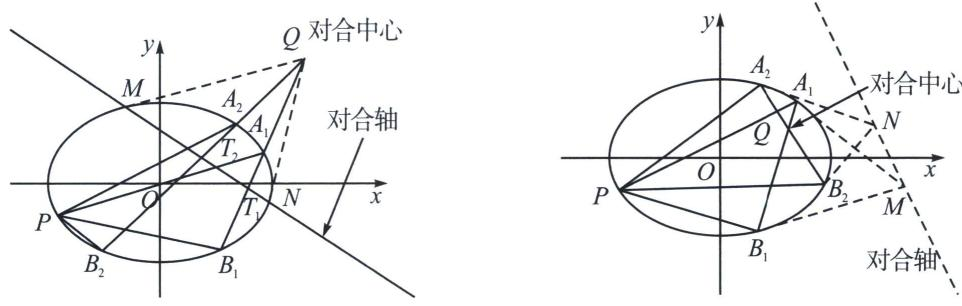
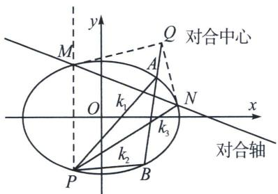
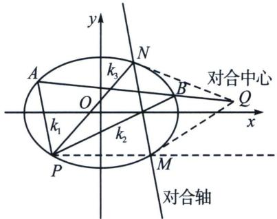
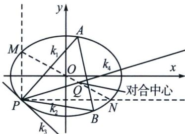

## 一、斜率对合的原理

关于点的对合，设 $P(x_{0}, y_{0})$ 为平面任意一个定点（通常都在二阶点列曲线上），AB 是这个二阶点列曲线（圆锥曲线就是二阶点列曲线）上的一点， $k_{1}=k_{AP}$ ， $k_{2}=k_{BP}$ 一个关于斜率的方程 $ak_{1}k_{2}+b(k_{1}+k_{2})+c=0$ ，无论 $k_{1}$ 和 $k_{2}$ 怎么变化, 直线 $A B$ 上找一个定点, 这个定点就是对合中心, 我们也通常称之为极点, 其对应的极线就是对合轴, 我们可以通过代数和几何角度来寻找对合轴和对合中心的过程, 就是我们理解斜率对合和斜率翻译的本质.

## 1. 对合轴与对合中心的选取

  
双曲型对合  
椭圆型对合

如上两图， $P(x_{0}, y_{0})$ 在曲线上， $k_{PA_{i}} = k_{1}$ ， $k_{PB_{i}} = k_{2}$ ，且无论如何均满足 $ak_{1}k_{2} + b(k_{1} + k_{2}) + c = 0$ 时，直线 $A_{1}B_{1}$ 与 $A_{2}B_{2}$ （也可以有 $A_{3}B_{3}$ ， $A_{4}B_{4}\cdots$ ）交于一定点 Q，这个直线过的定点就是这组对合变换的对合中心，以 Q 为极点，其对应的极线就是对合轴.

斜率对合的本质就是点的对合, 如果 $Q$ 是极点, 寻找其极线的方法非常简单, 如左图, 当极点 $Q$ 在二阶曲线外, 过 $Q$ 作二阶曲线的两条切线, 切于 $M$ 和 $N$ , 易知两切点为对合不动点, 两对合不动点的连线形成对合轴 $MN$ , 这也是最简单由对合中心确定对合轴的方式, 这类型对合中心在曲线外, 有两个对合不动点的对合类型, 我们称之为双曲型对合。如右图, 当极点 $Q$ 在二阶曲线内, 过 $Q$ 无法作二阶曲线的两条切线, 那就需要借助二阶曲线的共轭属性, 即极点共线与极线共点的共轭属性, 过 $A_{1}$ 和 $B_{1}$ 分别作椭圆的切线, 两切线交于 $M$ , 同理过 $A_{2}$ 和 $B_{2}$ 分别作椭圆的切线, 两切线交于 $N$ , 对合轴即为 $MN$ , 这类型对合中心在曲线内, 对合轴与曲线没有交点, 无对合不动点的对合类型, 我们称之为椭圆型对合.

根据之前我们对极点极线的理解，连接极点极线，与二阶点列截于两点，以上两图为例， $A_{1}$ 和 $B_{1}$ ， $A_{2}$ 和 $B_{2}$ 就被对合轴和对合中心连线的截点，四点形成调和点列，即 $(Q, T_{1}; A_{1}, B_{1}) = (Q, T_{2}; A_{2}, B_{2}) = -1$ ， $A_{1}$ 和 $B_{1}$ 是一组对合， $A_{2}$ 和 $B_{2}$ 也是一组对合，通俗一点理解就是轮换 $A_{1}$ 和 $B_{1}$ 的位置，用 $A_{1}$ 表示 $B_{1}$ ，或者用 $B_{1}$ 表示 $A_{1}$ 都是一样的，由于 $P(x_{0}, y_{0})$ 是定点， $k_{1} = \frac{y_{1} - y_{0}}{x_{1} - x_{0}}$ 与 $k_{2} = \frac{y_{2} - y_{0}}{x_{2} - x_{0}}$ 就是一种对合（两者可轮换），用 $k_{1}$ 表示 $k_{2}$ 与 $k_{2}$ 表示 $k_{1}$ 也是一样的，所以，在 Q 为对合中心，MN 作为对合轴， $k_{1}$ 与 $k_{2}$ 满足 $ak_{1}k_{2} + b(k_{1} + k_{2}) + c = 0$ ，就是一种对合.

## 2. 斜率对合的基本作图原理

在我们高中阶段，出现最多的考题就是 $k_{1} + k_{2} =$ 定值， $\frac{1}{k_1} +\frac{1}{k_2} =$ 定值，以及 $k_{1}k_{2} =$ 定值三种情况，我们本节就是重点介绍这三类对合的寻找对合中心和对合轴的过程.

$k_{1}+k_{2}=$ 定值型

## 高中数学 新思路 圆锥专题

本质：构造 $k_{1} + k_{2} = 2k_{3}$

以二阶点列上定点 $P(x_0, y_0)$ 为射影中心，如果 $k_1 + k_2 =$ 定值，则 $A$ 和 $B$ 为关于对合轴的一组对应，那么一定有一个对合不动点 $M$ 与 $P$ 连线与 $y$ 轴平行， $P$ 与另一个对合不动点 $N$ 的连线斜率为 $k_3$ ，则在这一组对合变换中，始终满足 $k_1 + k_2 = 2k_3$ ， $MN$ 为对合轴过， $M$ 和 $N$ 的切线交点 $Q$ 即为对合中心.

(2) $\frac{1}{k_1} +\frac{1}{k_2} =$ 定值型

本质：构造 $\frac{1}{k_1} +\frac{1}{k_2} = \frac{2}{k_3}$

以二阶点列上定点 $P(x_0, y_0)$ 为射影中心，如果 $\frac{1}{k_1} + \frac{1}{k_2} =$ 定值，则 $A$ 和 $B$ 为关于对合轴的一组对应，那么一定有一个对合不动点 $M$ 与 $P$ 连线与 $x$ 轴平行， $P$ 与另一个对合不动点 $N$ 的连线斜率为 $k_3$ ，则在这一组对合变换中，始终满足 $\frac{1}{k_1} + \frac{1}{k_2} = \frac{2}{k_3}$ ， $MN$ 为对合轴，过 $M$ 和 $N$ 的切线交点 $Q$ 即为对合中心.

注意 $k_{1} + k_{2} =$ 定值和 $\frac{1}{k_1} +\frac{1}{k_2} =$ 定值通常都是双曲型对合.

(3) $k_{1}k_{2}=$ 定值型

本质：构造 $k_{1}k_{2}=k_{3}k_{4}$

以二阶点列上定点 $P(x_0, y_0)$ 为射影中心，如果 $k_1 k_2 =$ 定值，则 $A$ 和 $B$ 为关于对合轴的一组对应，和型对合是一次型，可以“合二为一”，通过对合不动点把两个斜率转化为一个斜率，但是乘积型对合是属于二次对合（还有三次对合），那么一定要构造 $k_1 k_2 = k_3 k_4$ ，先过 $P$ 作与 $x$ 轴 $PN$ 和 $y$ 轴平行线 $PM$ ，连接 $MN$ ，则对合中心一定在直线 $MN$ （过原点）上，作点 $P$ 的切线，斜率为 $k_3 = -\frac{x_0 b^2}{y_0 a^2}$ （椭圆），此时认为 $P$ 与 $A$ 重合（二重点），则利用对合变换 $k_1 k_2 = k_3 k_4$ 得出 $k_4 = k_{\mathrm{PQ}}$ ，此时 $MN$ 与 $PQ$ 交点 $Q$ 即为对合中心.

由于乘积型对合的对合中心在射影中心构造过原点的斜边直线上，故不需要作出对合轴，并且乘积型对合可以是椭圆型对合，也可以是双曲型对合.

![[高中/总复习/专题/2026版高中《mst老唐说题》圆锥曲线专题（数学）/下册/第12章_调和点列与调和线束定理与对合关系/第四节_斜率对合与斜率翻译/一_斜率对合的原理/例题/Q00053184.md]]
![[高中/总复习/专题/2026版高中《mst老唐说题》圆锥曲线专题（数学）/下册/第12章_调和点列与调和线束定理与对合关系/第四节_斜率对合与斜率翻译/一_斜率对合的原理/例题/Q00053185.md]]
![[高中/总复习/专题/2026版高中《mst老唐说题》圆锥曲线专题（数学）/下册/第12章_调和点列与调和线束定理与对合关系/第四节_斜率对合与斜率翻译/一_斜率对合的原理/例题/Q00053186.md]]
![[高中/总复习/专题/2026版高中《mst老唐说题》圆锥曲线专题（数学）/下册/第12章_调和点列与调和线束定理与对合关系/第四节_斜率对合与斜率翻译/一_斜率对合的原理/例题/Q00053187.md]]
