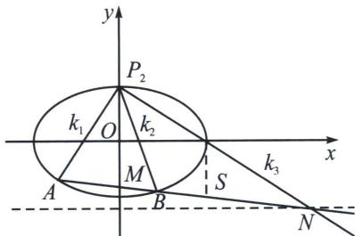
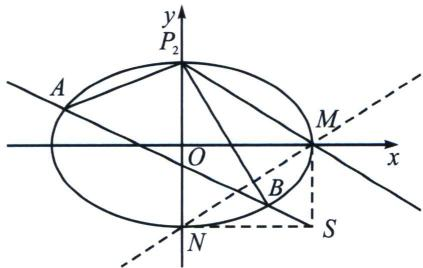

<!-- question-source:start -->
例1 (2017·新课标 I 理) 已知椭圆 $C: \frac{x^2}{a^2} + \frac{y^2}{b^2} = 1 (a > b > 0)$ , 四点 $P_1(1, 1), P_2(0, 1), P_3$ 老唐说题

$\left(-1, \frac{\sqrt{3}}{2}\right), P_4\left(1, \frac{\sqrt{3}}{2}\right)$ ，中恰有三点在椭圆 $C$ 上.

(1)求 $C$ 的方程;

(2)设直线 l 不经过 $P_{2}$ 点且与 C 相交于 A, B 两点. 若直线 $P_{2}A$ 与直线 $P_{2}B$ 的斜率的和为 -1，证明：l 过定点.

(1)根据椭圆的对称性, $P_{3}\left(-1, \frac{\sqrt{3}}{2}\right), P_{4}\left(1, \frac{\sqrt{3}}{2}\right)$ , 两点必在椭圆 $C$ 上, 又 $P_{4}$ 的横坐标为 1 , 所以椭圆必不过 $P_{1}(1, 1)$ , 所以 $P_{2}(0, 1), P_{3}\left(-1, \frac{\sqrt{3}}{2}\right), P_{4}\left(1, \frac{\sqrt{3}}{2}\right)$ , 三点在椭圆 $C$ 上. 把 $P_{2}(0, 1)$ , $P_{3}\left(-1, \frac{\sqrt{3}}{2}\right)$ , 代入椭圆 $C$ , 得: $\left\{ \begin{array}{l} \frac{1}{b^{2}} = 1 \\ \frac{1}{a^{2}} + \frac{3}{4b^{2}} = 1 \end{array} \right.$ , 解得 $a^{2} = 4, b^{2} = 1$ , 所以椭圆 $C$ 的方程为 $\frac{x^{2}}{4} + y^{2} = 1$ .

(2)证明: 将椭圆 $C$ 按照向量 $(0, -1)$ 平移, 则得到方程 $\frac{x^2}{4} + (y + 1)^2 = 1 \Rightarrow \frac{x^2}{4} + y^2 + 2y = 0$ , 平移后 $A \to A'$ , $B \to B'$ , 设 $A'B'$ 方程为 $mx + ny = 1$ , 即 $\frac{x^2}{4} + y^2 + 2y = \frac{x^2}{4} + y^2 + 2y (mx + ny) = 0$ (构造齐次式), 同除以 $x^2$ 得 $(1 + 2n)\frac{y^2}{x^2} + 2m\frac{y}{x} + \frac{1}{4} = 0$ , 因为点 $A'$ , $B'$ 的坐标满足这个方程, 所以 $k_{OA'}$ , $k_{OB'}$ 是这个关于 $\frac{y}{x}$ 的方程的两个根. 所以 $k_{OA'} + k_{OB'} = k_{PA} + k_{PB} = -\frac{2m}{1 + 2n} = -1 \Rightarrow 2m - 2n = 1$ , 故 $A'B'$ 过定点 $(2, -2)$ , 平移回去可得 $AB$ 过定点 $(2, -1)$ , 所以 $l$ 过定点 $(2, -1)$ .

极点极线背景分析：

方案一(调和线束斜率公式解读): 由于 $k_{P_2A} + k_{P_2B} = k_1 + k_2 = -1$ , 故需要构造 $k_1 + k_2 = 2k_3 = -1$ , 故 $k_3 = -\frac{1}{2}$ , 设 $AB$ 与 $y$ 轴交点为 $M(0, n)$ , 找到 $M$ 对应的极线 $y = \frac{1}{n}$ , 延长 $AB$ 交极线于 $N$ , 易知 $P_2(AB, MN) = -1 \Rightarrow k_{P_2N} = k_3 = -\frac{1}{2}$ ,

所以 $P_{2}N: y = -\frac{1}{2}x + 1$ ，所以 $N\left(2 - \frac{2}{n}, \frac{1}{n}\right)$ ，故 MN 的直线方程为 $y = -\frac{n+1}{2}x + n$ ，故 AB 过定点 $S(2, -1)$ .

方案二(对合中心分析): 过 $P_{2}$ 延 $y$ 轴 (斜率不存在) 交椭圆于对合不动点 $N(0, -1)$ , 过 $P_{2}$ 作斜率为 $-\frac{1}{2}$ 直线, 即 $y = -\frac{1}{2} x + 1$ 交椭圆于另一个不动点 $M(2, 0)$ , 此时 $MN$ 即为满足 $k_{P_{2} A} + k_{P_{2} B} = k_{1} + k_{2} = -1$ 的对合轴, 根据极点极线极配可知, 对合中心为两对合不动点切线的交点 $S(2, -1)$ , 对合轴 $MN$ 方程为 $y = \frac{x}{2} - 1$ .

注意 显然寻找对合轴和对合中心的方法相比利用极点极线的斜率公式构造调和点列，更容易找到定点定值.
<!-- question-source:end -->

![[高中/总复习/专题/2026版高中《mst老唐说题》圆锥曲线专题（数学）/下册/第12章_调和点列与调和线束定理与对合关系/第四节_斜率对合与斜率翻译/一_斜率对合的原理/例题/answers/Q00048834A1.md]]
