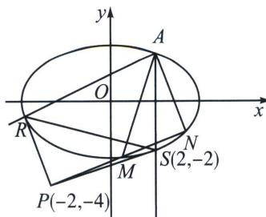

<!-- question-source:start -->
例2 (2024·城厢区模拟)已知椭圆 $C: \frac{x^{2}}{a^{2}} + \frac{y^{2}}{b^{2}} = 1 (a > b > 0)$ 的左、右顶点分别为 $A_{1}, A_{2}, Q$ 为椭圆 $C$ 上任意一点（与 $A_{1}, A_{2}$ 不重合），直线 $QA_{1}$ 和 $QA_{2}$ 的斜率之积为 $-\frac{1}{2}$ ，点 $A(2, 2)$ 在椭圆上.

(1)求椭圆 C 的标准方程;

(2) 过点 A 作斜率之和为 1 的两条直线分别与椭圆 C 交于 M, N 两点，直线 MN 是否过定点？若过定点，求出此定点；若不过定点，请说明理由.

(1)依题意, $A_{1}(-a,0), A_{2}(a,0)$ , 设 $Q(x_{0},y_{0})$ , 由点 $Q(x_{0},y_{0})$ 在椭圆上, 得 $\frac{x_{0}^{2}}{a^{2}} + \frac{y_{0}^{2}}{b^{2}} = 1$ , 由直线 $QA_{1}$ 和 $QA_{2}$ 的斜率之积为 $-\frac{1}{2}$ , 得 $\frac{y_{0}}{x_{0} + a} \cdot \frac{y_{0}}{x_{0} - a} = \frac{y_{0}^{2}}{x_{0}^{2} - a^{2}} = -\frac{b^{2}}{a^{2}} = -\frac{1}{2}$ , 即 $a^{2} = 2b^{2}$ , 由点 $A(2,2)$ 在椭圆上, 得 $\frac{4}{a^{2}} + \frac{4}{b^{2}} = 1$ , 解得 $a^{2} = 12, b^{2} = 6$ , 所以椭圆 $C$ 的标准方程为 $\frac{x^{2}}{12} + \frac{y^{2}}{6} = 1$ .

(1)将椭圆 $C$ 按照向量 $\overrightarrow{AO}$ : $(-2, -2)$ 平移, 则得到方程 $\frac{(x+2)^2}{12} + \frac{(y+2)^2}{6} = 1 \Rightarrow \frac{x^2}{12} + \frac{y^2}{6} + \left(\frac{x}{3} + \frac{2y}{3}\right) = 0$ , 平移后 $M \to M'$ , $N \to N'$ , 设 $M'N'$ 方程为 $mx + ny = 1$ , 联立得: $\frac{x^2}{12} + \frac{y^2}{6} + \left(\frac{x}{3} + \frac{2y}{3}\right)(mx + ny) = 0$ (构造齐次式), 由于斜率存在, 同除以 $x^2$ 得, $\left(\frac{1}{6} + \frac{2n}{3}\right) \frac{y^2}{x^2} + \left(\frac{2m}{3} + \frac{n}{3}\right) \frac{y}{x} + \frac{1}{12} + \frac{m}{3} = 0$ , 所以 $k_{OM'}$ , $k_{ON'}$ 是这个关于 $\frac{y}{x}$ 的方程的两个根. 所以 $k_{OM'} + k_{ON'} = k_{AM} + k_{AN} = -\frac{\frac{2m}{3} + \frac{n}{3}}{\frac{1}{6} + \frac{2n}{3}} = 1 \Rightarrow -4m - 6n = 1$ , 故 $M'N'$ 过定点 $(-4, -6)$ , 平移回去可得直线 $MN$ 过点 $(-2, -4)$ , 所以直线 $MN$ 过定点 $(-2, -4)$ .

对合中心分析：过 A 作 AS // y 轴交椭圆于 S(2, -2)，过 A 作斜率为 $\frac{1}{2}$ 直线，即 $y = \frac{1}{2}x + 1$ 交椭圆于 $R\left(-\frac{10}{3}, -\frac{2}{3}\right)$ ，和 S 均为不动点，点 S 处切线方程为 $\frac{2x}{12} + \frac{-2y}{6} = 1$ ，点 R 处切线方程为 $\frac{-\frac{10}{3}x}{12} + \frac{-\frac{2}{3}y}{6} = 1$ ，根据极点极线极配可知，联立 $\left\{\begin{aligned}\frac{2x_{P}}{12} + \frac{-2y_{P}}{6 &= 1 \\-\frac{10}{3}x_{P} &+\frac{-\frac{2}{3}y_{P}}{6} = 1\end{aligned}\right.$ 故对合中心为 P(-2, -4)，对合轴 RS 方程为 $y = -\frac{x}{4} - \frac{3}{2}$ .

<!-- question-source:end -->

![[高中/总复习/专题/2026版高中《mst老唐说题》圆锥曲线专题（数学）/下册/第12章_调和点列与调和线束定理与对合关系/第四节_斜率对合与斜率翻译/一_斜率对合的原理/例题/answers/Q00048835A1.md]]
