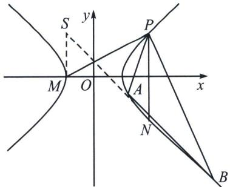
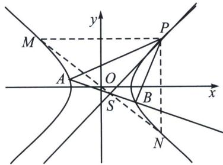

<!-- question-source:start -->
例4 (2023·石家庄一模)已知点 $P(4, 3)$ 在双曲线 $C: \frac{x^2}{a^2} - \frac{y^2}{b^2} = 1 (a > 0, b > 0)$ 上，过 $P$ 作 $x$ 轴的平行线，分别交双曲线 $C$ 的两条渐近线于 $M, N$ 两点， $|PM| \cdot |PN| = 4$ .

(1)求双曲线 C 的方程;

(2)若直线 l: $y=kx+m$ 与双曲线 C 交于不同的两点 A, B, 设直线 PA, PB 的斜率分别为 $k_{1}$ , $k_{2}$ , 从下面两个条件中选一个(多选只按先做给分), 证明: 直线 l 过定点.

$$
① k _ {1} + k _ {2} = 1; \quad ② k _ {1} k _ {2} = 1.
$$

(1)由双曲线的方程可得渐近线的方程 $y = \pm \frac{b}{a} x$ ，由题意可得过 $P(4,3)$ 与 $x$ 轴平行的直线方程为 $y = 3$ ，与两条渐近线的交点 $M, N$ 的横坐标分别为 $-\frac{3a}{b}, \frac{3a}{b}$ ，

所以 $|PM|\cdot |PN| = \left(4 + \frac{3a}{b}\right)\left(4 - \frac{3a}{b}\right) = 16 - \frac{9a^2}{b^2} = 4$ ，可得 $3a^{2} = 4b^{2}$ ，设双曲线的方程为： $\frac{x^2}{4t^2} -\frac{y^2}{3t^2} = 1,$ 将 $P(4,3)$ 代入双曲线的方程： $\frac{4}{t^2} -\frac{3}{t^2} = 1$ ，交点 $t^2 = 1$ ，所以双曲线的方程为： $\frac{x^2}{4} -\frac{y^2}{3} = 1;$

(2)证明: 设 $A(x_{1}, y_{1}), B(x_{2}, y_{2})$ , 因为直线 $AP, BP$ 分别为 $k_{1}, k_{2}$ , 用齐次式方程解答, 将双曲线方程按照向量 $\overrightarrow{PO} = (-4, -3)$ 平移, 则 $\frac{(x+4)^{2}}{4} - \frac{(y+3)^{2}}{3} = 1$ , 即 $\frac{x^{2}}{4} - \frac{y^{2}}{3} + 2x - 2y = 0$

设直线 $A'B'$ 的方程为 $mx + ny = 1$ ，联立得： $\frac{x^2}{4} - \frac{y^2}{3} + (2x - 2y)(mx + ny) = 0$ ，由于斜率存在，故同除以 $x^2$ 得， $\left(-2n - \frac{1}{3}\right)\left(\frac{y}{x}\right)^2 + (2n - 2m)\frac{y}{x} + \frac{1}{4} + 2m = 0$ ，可得 $k_1 + k_2 = \frac{6n - 6m}{1 + 6n}$ ， $k_1k_2 = \frac{-(3 + 24m)}{4 + 24n}$ ，

若选①： $k_{1}+k_{2}=1$ ，可得 $\frac{6n-6m}{1+6n}=1$ ，可得 $m=-\frac{1}{6}$ ，所以直线 $A^{\prime}B^{\prime}$ 过 $(-6,0)$ ，直线l恒过定点 $(-2,3)$ ;

若选②： $k_{1}k_{2}=1$ ，可得 $\frac{-(3+24m)}{4+24n}=1$ ，整理可得 $-\frac{24}{7}m-\frac{24}{7}n=1$ ，所以直线 $A^{\prime}B^{\prime}$ 过 $\left(-\frac{24}{7},-\frac{24}{7}\right)$ ，即直线l恒过定点 $\left(\frac{4}{7},-\frac{3}{7}\right)$ .

对合中心分析: 选①. 过 $P$ 作斜率为 $\frac{1}{2}$ 的直线交双曲线于第一个对合不动点 $M(-2,0)$ , 再过 $P$ 作 $y$ 轴平行线交双曲线于另一个对合不动点 $N(4,-3)$ , 分别作出两切线 $\left\{\begin{array}{l} x=-2 \\ \frac{4x}{4}-\frac{-3y}{3}=1 \end{array}\right.$ , 它们交点就是对合中心 $S(-2,3)$ .

选②. 作点 $P$ 处切线 $l: \frac{4x}{4} - \frac{3y}{3} = 1$ , 即 $y = x - 1$ , 此时切线斜率为 1, 则 $P$ 与 $A$ 和 $B$ 均重合, 再过 $P$ 作 $x$ 轴平行线和 $y$ 轴平行线分别交于 $M(-4, 3)$ 和 $N(4, -3)$ , 此时 $MN: y = -\frac{3}{4}x$ , 点 $P$ 处的切线 $y = x - 1$ , 联立 $\left\{ \begin{array}{l} y = x - 1 \\ y = -\frac{3}{4}x \end{array} \right.$ , 可得对合中心为 $S\left(\frac{4}{7}, -\frac{3}{7}\right)$ .

注意 当射影中心 $P$ 已知的情况下，齐次化这种斜率对合方程永远是最好的解答方法.
<!-- question-source:end -->

![[高中/总复习/专题/2026版高中《mst老唐说题》圆锥曲线专题（数学）/下册/第12章_调和点列与调和线束定理与对合关系/第四节_斜率对合与斜率翻译/一_斜率对合的原理/例题/answers/Q00048837A1.md]]
