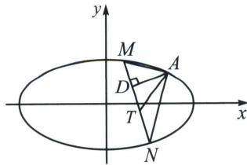

<!-- question-source:start -->
例3 (2020·山东)已知椭圆 $C: \frac{x^2}{a^2} + \frac{y^2}{b^2} = 1 (a > b > 0)$ 的离心率为 $\frac{\sqrt{2}}{2}$ , 且过点 $A(2, 1)$ .

(1)求 C 的方程;

(2)点 M, N 在 C 上，且 $AM \perp AN$ ， $AD \perp MN$ ，D 为垂足．证明：存在定点 Q，使得 $|DQ|$ 为定值.

<!-- question-source:end -->

![[高中/总复习/专题/2026版高中《mst老唐说题》圆锥曲线专题（数学）/下册/第12章_调和点列与调和线束定理与对合关系/第四节_斜率对合与斜率翻译/一_斜率对合的原理/例题/answers/Q00053186A1.md]]
