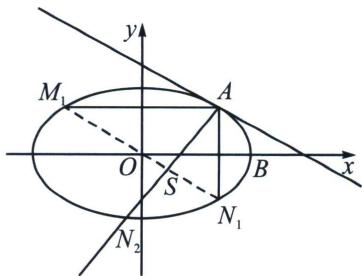

> [!faq]- 《圆锥曲线专题(下册)》例题解析
>
> > [!success]- **【答案】** 详见解析
>
> > [!note]- **【分析】**
> > 作 $AM_{1} \parallel x$ 轴交 $C$ 于 $M_{1}(-2, 1)$ , 作 $AN_{1} \parallel y$ 轴交 $C$ 于 $N_{1}(2, -1)$ , 此时 $M_{1} N_{1}: y = -\frac{x}{2}$ , 令 $A$ 与 $M_{2}$ 重合, 此时过 $A$ 作椭圆 $C$ 的切线 $l: \frac{2x}{6} + \frac{y}{3} = 1$ , 即 $y = -x + 3$ , 作 $AN_{2} \perp l$ , 此时 $AN_{2}: y = x - 1$ , 此时 $\left\{ \begin{array}{l} y = -\frac{x}{2} \\ y = x - 1 \end{array} \right.$ 求得对合中心为 $S\left( \frac{2}{3}, -\frac{1}{3} \right)$ , 接下来再分析 $Q$ 为 $AS$ 中点 $\left( \frac{4}{3}, \frac{1}{3} \right)$ .
>
> > [!note]- **【解析】**
> > 
