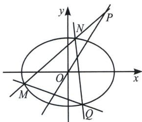
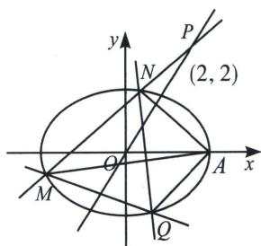

<!-- question-source:start -->
例27 已知椭圆 $C: \frac{x^2}{4} + y^2 = 1$ ，过点 $P(2, 2)$ 的直线 $l$ 交椭圆 $C$ 于 $M$ ， $N$ 两点。 $Q$ 为椭圆 $C$ 上异于 $M$ ， $N$ 的一点，满足弦 $MQ$ 的中点在直线 $OP$ 上。试判断直线 $NQ$ 是否过定点？若是，求出定点坐标；若不是，请说明理由

<!-- question-source:end -->

![[高中/总复习/专题/2026版高中《mst老唐说题》圆锥曲线专题（数学）/下册/第12章_调和点列与调和线束定理与对合关系/第四节_斜率对合与斜率翻译/七_二次型斜率对合方程模型/例题/answers/Q00048867A1.md]]
