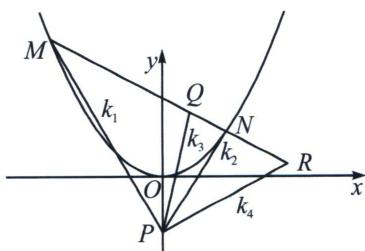

<!-- question-source:start -->
例26 (2024·江苏模拟)已知 F 为抛物线 C: $x^{2}=2py(p>0)$ 的焦点，点 A 在 C 上， $\overrightarrow{FA}=\left(\sqrt{3}, -\frac{1}{4}\right)$ .
点 $P(0,-2)$ ，M，N是抛物线上不同两点，直线PM和直线PN的斜率分别为 $k_{1}$ ， $k_{2}$ .

(1)求 $C$ 的方程;

(2)存在点 $Q$ ，当直线 $MN$ 经过点 $Q$ 时， $3(k_{1} + k_{2}) - 2k_{1}k_{2} = 4$ 恒成立，请求出满足条件的所有点 $Q$ 的坐标；

(3)对于
(2)中的一个点 $Q$ , 当直线 $MN$ 经过点 $Q$ 时, $|MN|$ 存在最小值, 试求出这个最小值.

(1)由题 $F\left(0, \frac{p}{2}\right)$ , 设 $A\left(x_{1}, \frac{x_{1}^{2}}{2p}\right)$ , 则 $\overrightarrow{FA} = \left(x_{1}, \frac{x_{1}^{2}}{2p} - \frac{p}{2}\right) = \left(\sqrt{3}, -\frac{1}{4}\right)$ , 所以 $\left\{ \begin{array}{l} x_{1} = \sqrt{3}, \\ \frac{x_{1}^{2}}{2p} - \frac{p}{2} = -\frac{1}{4}, \end{array} \right.$ 消去 $x_{1}$ 得 $2p^{2} - p - 6 = 0$ , 解得: $p = 2$ 或 $p = -\frac{3}{2}$ (舍), 所以 $C$ 的方程为 $x^{2} = 4y$ ;

(2)极点极线背景: 设 $P(A, B; Q, R) = -1$ , 因为射影中心在曲线外, 所以根据调和线束斜率公式

$$
3 (k _ {1} + k _ {2}) - 2 k _ {1} k _ {2} = 4 \Longleftrightarrow (k _ {1} + k _ {2}) (k _ {3} + k _ {4}) = 2 (k _ {1} k _ {2} + k _ {3} k _ {4}) \Longleftrightarrow \left\{ \begin{array}{l l} k _ {3} + k _ {4} = 3 \\ k _ {3} k _ {4} = 2 \end{array} \right. \Longleftrightarrow \left\{ \begin{array}{l l} k _ {3} = 1 \\ k _ {4} = 2 \end{array} \text {或} \left\{ \begin{array}{l l} k _ {3} = 2 \\ k _ {4} = 1 \end{array} \right., \right.
$$

所以 $\left\{ \begin{array}{l} \frac{y_{Q_1} + 2}{x_{Q_1}} = 2 \\ \frac{y_{Q_2} + 2}{x_{Q_2}} = 1 \end{array} \right.$ ，根据二阶点列曲线的共轭与对偶原理，当 $PR: y = 2x - 2$ （极线）时，此时 $Q_1(4, 2)$

(极点)，同理当 PR: y = x - 2，此时 $Q_{2}(2, 2)$ (极点);

(3)解法一: 若 $MN$ 过 (4, 2) 点, 当 $k_{1} = k_{2} = 2$ 时, $3(k_{1} + k_{2}) - 2k_{1}k_{2} = 4$ , 但此时 $M, N$ 重合, 则 $|MN|$ 无最小值, 所以 $MN$ 只能过 (2, 2) 点, 此时 $|MN|$ 有最小值, 由
(2), 令 $m = 2 - 2k$ , 则 $x_{1} + x_{2} = 4k$ , $x_{1} \cdot x_{2} = 8k - 8$ ,

$$
\begin{array}{r l} & {\text {则} \mid M N \mid = \sqrt {(x _ {1} - x _ {2}) ^ {2} + (y _ {1} - y _ {2}) ^ {2}} = \sqrt {1 + k ^ {2}} \mid x _ {1} - x _ {2} \mid = \sqrt {1 + k ^ {2}} \sqrt {(x _ {1} + x _ {2}) ^ {2} - 4 x _ {1} x _ {2}}} \\ & {\qquad = \sqrt {1 + k ^ {2}} \sqrt {(4 k) ^ {2} - 4 (8 k - 8)} = 4 \sqrt {k ^ {4} - 2 k ^ {3} + 3 k ^ {2} - 2 k + 2}, \text {令} f (k) = k ^ {4} - 2 k ^ {3} + 3 k ^ {2} - 2 k + 2,} \end{array}
$$

则 $f'(k)=4k^{3}-6k^{2}+6k-2=2(2k-1)(k^{2}-k+1)=0$ ，令 $f'(k)=0$ ，则 $k=\frac{1}{2}$ ，又 $k^{2}-k+1=\left(k-\frac{1}{2}\right)^{2}+\frac{3}{4}>0$ ，所以当 $k<\frac{1}{2}$ 时， $f'(k)<0$ ， $f(k)$ 在 $\left(-\infty,\frac{1}{2}\right)$ 上为减函数，当 $k>\frac{1}{2}$ 时， $f'(k)>0$ ， $f(k)$ 在 $\left(\frac{1}{2},+\infty\right)$ 上为增函数，所以当 $k=\frac{1}{2}$ 时， $f(k)$ 有最小值，即 $|MN|$ 有最小值，所以 $|MN|_{\min}=\sqrt{1+k^{2}}\sqrt{(4k)^{2}-4(8k-8)}=4\sqrt{1+k^{2}}\sqrt{k^{2}-2k+2}=4\sqrt{1+\frac{1}{4}}\sqrt{\frac{1}{4}-1+2}=5.$
<!-- question-source:end -->

![[高中/总复习/专题/2026版高中《mst老唐说题》圆锥曲线专题（数学）/下册/第12章_调和点列与调和线束定理与对合关系/第四节_斜率对合与斜率翻译/七_对合方程_ak__1_k__2____b_k__1____k__2_____/例题/answers/Q00048866A1.md]]
