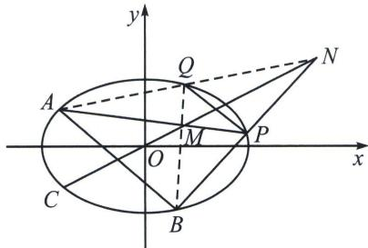

> [!faq]- 《圆锥曲线专题(下册)》例题解析
>
> > [!success]- **【答案】** 详见解析
>
> > [!note]- **【分析】**
> > 本题未单列分析。
>
> > [!note]- **【解析】**
> > 解析
> > 解法一(硬撸): 由题设直线 $MN: y = kx + m, M(x_1, y_1), N(x_2, y_2)$ ,
> > 联立 $\left\{\begin{aligned}x^{2}&=4y\\ y&=kx+m\end{aligned}\right.$ ，消去y得 $x^{2}-4kx-4m=0$ ，则 $\triangle=16(k^{2}+m)>0$ ， $x_{1}+x_{2}=4k$ ， $x_{1}\cdot x_{2}=-4m$ ，
> > 所以 $k_{1} = \frac{y_{1} + 2}{x_{1}} = \frac{kx_{1} + m + 2}{x_{1}} = k + \frac{m + 2}{x_{1}}, k_{2} = \frac{y_{2} + 2}{x_{2}} = \frac{kx_{2} + m + 2}{x_{2}} = k + \frac{m + 2}{x_{2}},$
> > $$
> > k _ {1} + k _ {2} = 2 k + (m + 2) \left(\frac {1}{x _ {1}} + \frac {1}{x _ {2}}\right) = 2 k + (m + 2) \cdot \frac {x _ {1} + x _ {2}}{x _ {1} x _ {2}} = \frac {k (m - 2)}{m}
> > $$
> > $$
> > k _ {1} k _ {2} = \frac {(k x _ {1} + m + 2) (k x _ {2} + m + 2)}{x _ {1} x _ {2}} = \frac {k ^ {2} x _ {1} x _ {2} + k (m + 2) (x _ {1} + x _ {2}) + (m + 2) ^ {2}}{x _ {1} x _ {2}} = \frac {8 k ^ {2} + (m + 2) ^ {2}}{- 4 m},
> > $$
> > 因为 $3(k_{1} + k_{2}) - 2k_{1}k_{2} = 4$ ，即 $3\times \frac{k(m - 2)}{m} -2\times \frac{8k^2 + (m + 2)^2}{-4m} -4 = 0,$
> > 即 $(2k+m-2)(4k+m-2)=0$ ，则m=2-2k或m=2-4k，能满足△>0，
> > 则直线 MN 的方程为： $y=kx+2-2k=k(x-2)+2$ ，或 $y=kx+2-4k=k(x-4)+2$ ，
> > 所以定点 Q 的坐标为 $(2, 2)$ 或 $(4, 2)$ ;
> > 解法二：当直线 $MN: (x_{1} + x_{2})x = 4y + x_{1}x_{2}$ ， $k_{1} = \frac{y_{1} + 2}{x_{1}} = \frac{x_{1}}{4} + \frac{2}{x_{1}}$ ， $k_{2} = \frac{x_{2}}{4} + \frac{2}{x_{2}}$
> > $$
> > 3 \left(k _ {1} + k _ {2}\right) - 2 k _ {1} k _ {2} = 4 \Leftrightarrow x _ {1} ^ {2} x _ {2} ^ {2} + 8 \left(x _ {1} ^ {2} + x _ {2} ^ {2}\right) + 3 2 x _ {1} x _ {2} + 6 4 - 6 x _ {1} x _ {2} \left(x _ {1} + x _ {2}\right) - 4 8 \left(x _ {1} + x _ {2}\right) = 0,
> > $$
> > 本题要构造 $(x_{1} + x_{2})x_{0} = 4y_{0} + x_{1}x_{2}\Leftrightarrow x_{1}x_{2} - (x_{1} + x_{2})x_{0} + 4y_{0} = 0$ ，所以 $x_{1}^{2}x_{2}^{2} + 16x_{1}x_{2} + 64 + 8(x_{1}^{2}+$ $2x_{1}x_{2} + x_{2}^{2}) - 6x_{1}x_{2}(x_{1} + x_{2}) - 48(x_{1} + x_{2}) = 0$
> > 所以 $[x_{1}x_{2} + 8 - 2(x_{1} + x_{2})][x_{1}x_{2} + 8 - 4(x_{1} + x_{2})] = 0$ ，所以 $4(x_{1} + x_{2}) = 8 + x_{1}x_{2}$ 或 $2(x_{1} + x_{2}) = 8+$ $x_{1}x_{2}$ ，所以定点 $Q$ 的坐标为(2，2)或(4，2)；
> > 注意： $\left\{ \begin{array}{l} k_{3} + k_{4} = 3 \\ k_{3}k_{4} = 2 \end{array} \right.$ ，这也说明直线 $PQ$ 和 $PR$ 也是一组对合，一定会得到 $(2k + m - 2)(4k + m - 2) = 0$ 或者 $[x_{1}x_{2} + 8 - 2(x_{1} + x_{2})][x_{1}x_{2} + 8 - 4(x_{1} + x_{2})] = 0$ 的等式.
> > 解法二： $\left\{ \begin{array}{l}x = 2 + t\cos \alpha \\ y = 2 + t\sin \alpha \end{array} \right.$ ，代入 $x^{2} = 4y$ ，则 $t^2\cos^2\alpha +4t(\cos \alpha -\sin \alpha) - 4 = 0,\quad |t_1 - t_2| = 4\sqrt{\frac{2\cos^2\alpha - 2\sin\alpha\cos\alpha + \sin^2\alpha}{\cos^4\alpha}} =$ $\sqrt{\frac{(2\cos^2\alpha - 2\sin\alpha\cos\alpha + \sin^2\alpha)(\sin^2\alpha + \cos^2\alpha)}{\cos^4\alpha}} = 4\sqrt{(\tan^2\alpha + 1)(\tan^2\alpha - 2\tan\alpha + 2)}$ ，与解法一计算量基本一致.
> > ## 2. 中点平行弦模型
> > 已知 $A 、 B 、 C$ 为椭圆 $\frac{x^{2}}{a^{2}} +\frac{y^{2}}{b^{2}} = 1(a > b > 0)$ 上三个不同的定点，且线段 $AB$ 的中点在直线 $OC$ 上，点 $P$ 为椭圆上的动点，直线 $PA 、 PB$ 分别交直线 $OC$ 于点 $M 、 N$ ，则有：
> > 
> > - **①**：$k_{AB} \cdot k_{OC} = -\frac{b^{2}}{a^{2}}$ ;
> > - **②**：$|OM| \cdot |ON| = |OC|^{2}$ .
> > - **③**：连接 AN，交椭圆于点 Q，则 $PQ \parallel AB$ ，④设 $N(m, n)$ ，则直线 AP 与 BQ 都过定点 $M\left(\frac{m}{\frac{m^{2}}{a^{2}}+\frac{n^{2}}{b^{2}}}, \frac{n}{\frac{m^{2}}{a^{2}}+\frac{n^{2}}{b^{2}}}\right)$ .
> > ▶注意 如果已知点 N 的坐标和 AB 的斜率，也可得到： $PQ \parallel AB$ ；直线 AP 与 BQ 都过定点 M.
> > - **对于④**：的背景是： $\left\{\begin{aligned}\frac{mx_{M}}{a^{2}}+\frac{ny_{M}}{b^{2}}=1\text{(调和共轭)}\\ \frac{y_{M}}{x_{M}}=\frac{n}{m}\end{aligned}\right.\Rightarrow\left\{\begin{aligned}x_{M}&=\frac{ma^{2}b^{2}}{b^{2}m^{2}+a^{2}n^{2}}\\ y_{M}&=\frac{na^{2}b^{2}}{b^{2}m^{2}+a^{2}n^{2}}\end{aligned}\right.$
